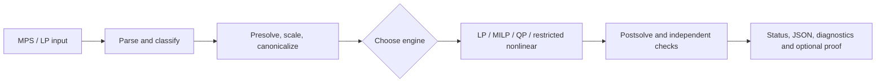

<p align="center">
  
</p>

# markov-cero

**Optimization for a higher yield** · **Team: markov-cero team** · **Smart India Hackathon 2026, problem statement SIH26119 (MRPL)** · **Version 0.5.2**

markov-cero is a C++20 mathematical optimization solver research project built around a practical question: how can a team model a refinery decision, solve it, and show enough evidence to trust the reported answer? The repository contains the solver core, command-line tools, Python bindings, a visual web experience, refinery examples, benchmark runners, independent result checks, and dated qualification records.

The current release is a **research prototype**. It is not an approved refinery planning system or a demonstrated replacement for established commercial solvers. The team presents measured results with their model, machine, time limit, and verification boundary so judges and contributors can distinguish implemented features from proven performance.

## The challenge and our approach

Refinery planning combines limited feedstocks, unit capacities, product demand, blend quality and economic trade-offs. A useful solver needs more than a fast objective value: it needs an auditable path from input data to a feasible decision and an honest account of numerical and operational limits.

| Challenge | markov-cero approach | Evidence or boundary |
|---|---|---|
| Express planning decisions | Free-format MPS and LP input, sparse model representation, quadratic MPS extensions, and documented refinery examples | [Example models](examples/refinery/README.md), [capability register](docs/project/STATUS.md) |
| Solve several model classes | Revised and dual simplex, interior-point and PDLP for LP; branch-and-cut for MILP; ADMM/KKT for convex QP and MIQP; restricted SQP/OA experiments | [Implementation map](docs/README.md) |
| Check results independently | Original-model feasibility, canonical LP witnesses, QP KKT checks, and bounded numerical tree replay for supported MILP/MIQP cases | [Verification guide](docs/guides/VERIFY.md) |
| Compare with established tools | Hash-pinned instance and comparator manifests, recorded local runs, explicit time limits, and result-level agreement checks | [Evidence index](evidence/INDEX.md) |
| Make the system accessible | C++ API, JSON-emitting CLI, Python binding, and an optional authenticated web workspace | [Quickstart](docs/guides/QUICKSTART.md), [web app](web/README.md) |

The solver path is deliberately traceable from a model file to a checked result:



## What is implemented

- **Core pipeline:** checked input parsing, model classification, sparse canonicalization, reversible presolve, Ruiz scaling, engine dispatch, postsolve, and result telemetry.
- **LP:** primal revised simplex, dual warm simplex, interior-point, and matrix-free PDLP. Sparse LU supports fill-aware pivot selection, reuse and a cooperative deadline.
- **Mixed integer:** branch-and-cut with cuts, heuristics, strong branching, parallel tree search, queued-node limits, and proof export where the numerical guarantee can be replayed.
- **Quadratic:** convex QP through ADMM and sparse KKT work, plus MIQP relaxations with independent residual checks.
- **Nonlinear research:** SQP and restricted convex/quadratic outer approximation. A local NLP optimum is not a global proof; arbitrary nonlinear MINLP is outside the accepted path.
- **GPU research:** optional CUDA kernels for PDLP operations and a partial QP matrix-vector path. Current measured RTX 2050 cases did not show an end-to-end GPU speed advantage over CPU PDLP.
- **ML research:** optional branching inference and data collection exist, but no trained runtime model has passed the promotion gate.

The [status register](docs/project/STATUS.md) gives feature-specific conditions and open issues. Code presence alone does not establish a verified result on an unseen model.

## Quick start

From the repository root, use CMake 3.25 or newer and a C++20 compiler:

```sh
cmake -S . -B build -DCMAKE_BUILD_TYPE=Release
cmake --build build --parallel 2
./build/markov-cero-solve examples/blend.mps
./build/markov-cero-solve examples/qp_portfolio.mps --engine qp
ctest --test-dir build --output-on-failure
```

Run the small refinery qualification scenario with:

```sh
bash scripts/run-qualification-demo.sh
```

The demo uses a synthetic two-crude model, runs the CLI, and prints JSON results and the verification verdict. It does not validate a live MRPL plant model. For a guided first run, CLI options and expected result interpretation, see the [quickstart](docs/guides/QUICKSTART.md). Build flags, installation and optional CUDA/Python requirements are in [building](docs/guides/BUILDING.md).

## Refinery demonstration

The repository contains synthetic feasible, infeasible, resource-limited and malformed refinery cases, plus an attributed historical public Fawley input converted into MPS. The 29-row, 36-column public-input model includes feed consumption, capacities, recipe blending and explicit quality bases. A recorded local run agreed with a development HiGHS oracle on objective **−2899.252790423** in thousand historical USD per period. This is evidence for that generated mathematical model, not proof of physical plant validity or suitability for operations.

A refinery engineer still needs to validate feed and quality balances and own a shadow trial before operational claims. Read the [case guide](examples/refinery/README.md), [input provenance](docs/project/PROVENANCE.md), and [release gates](evidence/gate-status-20260929.json).

## Evaluation: results with boundaries

The table below points to **dated runs**, not tests rerun by viewing this README. Source, binary, instances and method can differ from the current checkout.

| Recorded evaluation | Observation | What it establishes |
|---|---|---|
| Five-solver, 23-case comparison | markov-cero 17/23 optimal; HiGHS 17/23; GLPK 14/23; CBC 13/23; SCIP 18/23, with no disagreement between paired verified optimal objectives | Agreement on reported optima in this suite; six markov-cero cases failed or timed out ([report](evidence/comparison/current_glpk_pinned_20260928/full_comparison_report.md)) |
| Pinned, repeated 20-case HiGHS comparison | Verified objective agreement 20/20 at one and four markov-cero threads | Correctness on preregistered cases; reported geometric runtime ratios of 15.61× and 12.76× markov-cero/HiGHS favored HiGHS and used differing timing boundaries ([one thread](evidence/compare/current_final_threads1_20260928/report.md), [four threads](evidence/compare/current_final_threads4_20260928/report.md)) |
| Local 15-second benchmark sweep | 255 checked-in Netlib, MIPLIB, Mittelmann and QPLIB rows attempted | Coverage of those local inputs and that time cap; it is not the full upstream corpora or a 300-second industrial study ([run index](evidence/INDEX.md)) |
| RTX 2050 GPU PDLP checks | Four measured generated cases verified in repeated runs; GPU was slower end to end | Device-path correctness on those cases, without a demonstrated speed benefit ([host record](evidence/gpu_hardware_host_access_check_20260928.json)) |

The [evidence index](evidence/INDEX.md) separates current entry points, frozen baselines and historical runs. Optional large benchmark files are listed in the [hash-pinned dataset manifest](data/optional-datasets.json); they are not required for the default build.

## Verification and result meaning

The CLI writes JSON with model class, selected engine, status, objective or bound, diagnostics and verification fields. `Optimal`, `Infeasible` and `Unbounded` are only as strong as the accompanying witness and its stated model class. A time, node, memory, numerical or proof budget can leave a useful incumbent while the global conclusion remains unverified. `verified` describes the result-level gate; `original_verified` and certificate fields describe narrower checks.

For supported linear MILP and convex MIQP results, a separate checker can replay an exported cut-free numerical proof tree:

```sh
./build/markov-cero-verify-mip model.mps proof.txt
./build/markov-cero-iis infeasible.mps
```

Proof construction and replay have explicit time, node and witness limits. The replay checker shares parser and numerical primitives with the core, so it is independent of search logic but is not an exact-arithmetic or plant-model certificate. See [verification](docs/guides/VERIFY.md).

## Repository map

| Directory | Purpose |
|---|---|
| [`src/`](src/) and [`include/markov_cero/`](include/markov_cero/) | Solver implementation and public C++ API |
| [`apps/`](apps/) | CLI entry points |
| [`gpu/`](gpu/) | Optional CUDA backend, kernels and tests |
| [`python/`](python/) | Python package, binding source and tests |
| [`web/`](web/) | Visual frontend and optional HTTP adapter |
| [`examples/`](examples/) and [`data/`](data/) | Demonstration models, local fixtures and dataset manifests |
| [`tests/`](tests/) and [`scripts/`](scripts/) | Regression, fuzz, verification, benchmark and demo tooling |
| [`docs/`](docs/) | Current guides, project records and dated research notes |
| [`evidence/`](evidence/) | Dated benchmark, hardware, qualification and gate records |
| [`cmake/`](cmake/) and [`third_party/`](third_party/) | Build definitions and dependency license ledger |

Build outputs, downloaded optional datasets, local environments and web dependencies are ignored. The tracked evidence directories preserve run context, including some repeated or empty-category results.

## Interfaces and deployment

- **C++:** include `markov_cero/api/solve.hpp`, link the installed `markov_cero::core` target, and use `SolveOptions`/`SolveResult`.
- **CLI:** `markov-cero-solve MODEL.mps --engine auto --time-limit 60 --output result.json`; inspect `--help` for the full option list.
- **Python:** `python -m pip wheel .` builds an isolated CPU core and the `markov_cero` extension; see [building](docs/guides/BUILDING.md).
- **Web:** `web/` is a Vite/React presentation and an optional authenticated workspace. Live solves require a separately configured HTTP adapter; the visual site alone does not run the solver. See [web setup](web/README.md).

A standard CMake prefix install includes the library, CLI binaries and headers. CUDA, benchmark comparators and web deployment require separate configuration. No deployment is implied by the files in this repository.

## Team, stewardship and release status

**Team name:** markov-cero team. No verified public member roster is maintained in this repository, so individual names and roles are not claimed here. The project was prepared for Smart India Hackathon 2026 problem statement SIH26119. Substantial implementation used AI coding assistance under human direction; authors remain responsible for mathematical review, evidence and release claims. [Provenance](docs/project/PROVENANCE.md) records the source-exposure boundary, which still needs independent review.

The v0.5.2 release gate remains open on resource coverage, provenance review, benchmark breadth, GPU benefit, support ownership and refinery engineer sign-off. See [status](docs/project/STATUS.md), [gate status](evidence/gate-status-20260929.json), [changelog](CHANGELOG.md), and the [original request](docs/project/ORIGINAL_REQUEST.md). The [Apache 2.0 license](LICENSE) and Python package metadata now agree: an owner decision on 2026-09-29 set `pyproject.toml` to `Apache-2.0`, and CI re-checks the coherence. The reproducible source/binary baseline for later blueprint work is the [baseline manifest](evidence/baseline-manifest-20260929.json).
