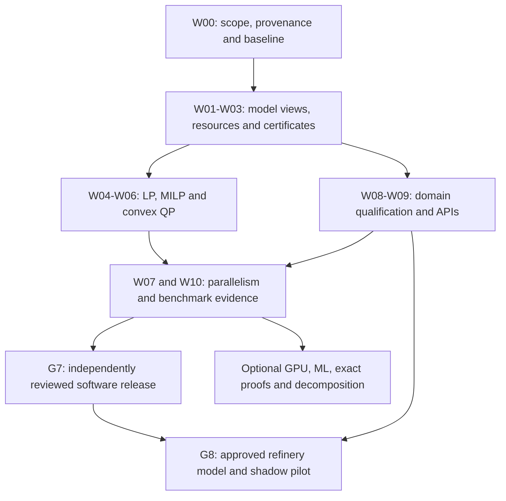

# Industry-grade solver and competitive roadmap

**Project:** markov-cero · **Prepared:** 28 September 2026 · **Status:** proposed implementation programme, not completed work or a performance guarantee.

**Objective:** build a dependable, maintainable sovereign optimization engine; establish a measurable advantage on selected industrial workloads; satisfy SIH26119 with reproducible evidence; expand competitive coverage only as acceptance gates pass.

This document is the forward roadmap. The [implementation/closure plan](INDUSTRY-READINESS-IMPLEMENTATION-PLAN.md), [defect register](../../evidence/defect-closure-register.csv) and [current validation checkpoint](../../evidence/readiness-checkpoint.json) remain the records of completed work. Numerical claims below distinguish mathematical guarantees, measured results and proposed engineering targets.

## How to use this document

- [Strategy and baseline](#1-executive-decisions): supported scope and competitive objective.
- [Decisions D01–D28](#4-decision-register): defaults, alternatives and accountable owners.
- [Mathematics M1–M15](#5-mathematical-contract-and-proof-obligations): invariants, derivations and limitations.
- [Architecture](#6-target-software-architecture) and [packages W00–W14](#7-ordered-implementation-packages): implementation work and acceptance evidence.
- [Milestones and gates](#8-delivery-sequence-and-acceptance-gates): dependency order, with no staffing or deadline assumptions.
- [Benchmark protocol](#9-benchmark-protocol-that-can-defend-a-competitive-claim): how an advantage can actually be established.
- [GPU programme GPU-01–09](#gpu-programme) and [ML programme ML-01–10](#ml-programme): implementation sequence, numerical safety, data/training/inference and promotion gates.
- [SIH evidence](#10-sih-evaluator-evidence-package), [industrial adoption](#11-business-and-refinery-adoption-plan) and [release policy](#12-verification-and-release-policy).
- [Risks](#13-risks-stop-rules-and-decisions-that-remain-external) and [first implementation backlog](#14-first-implementation-backlog-after-this-plan-is-accepted).

## 1. Executive decisions

1. **Build the engine first.** Ship LP, MILP and convex QP as the supported product. Keep convex MIQP behind its own qualification gate; NLP/MINLP and nonconvex pooling remain experimental until their separate guarantees are established.
2. **Choose one initial competitive workload:** repeated sparse refinery planning and scenario optimization, including multi-period production and supply-chain cases. Preserve general LP/MILP/QP compatibility, but optimise first for this declared workload. This is a recommendation, not evidence that the niche is already won.
3. **Make correctness independently inspectable.** Separate solution feasibility, objective bounds, numerical certificates, proof completeness and physical model validity. A single `verified` boolean is insufficient as the long-term contract.
4. **Finish resource isolation before adding features.** Close IR-19, IR-20 and IR-21: immutable node views, end-to-end cancellation and solve-wide memory control.
5. **Retain CPU as the default.** Promote GPU, parallel search or ML only after held-out end-to-end evidence passes. The existing GPU observations do not establish a speedup.
6. **Compete against specific versions and problem classes.** HiGHS for LP/MILP, SCIP and CBC for MILP, OSQP and HiGHS for convex QP, and OR-Tools PDLP for very large sparse LP. Compare only supported overlapping formulations.
7. **Offer an offline library/CLI first.** Add a process-isolated batch worker for industrial integration; a service or GUI follows demonstrated user demand. No initial cloud dependency.
8. **Do not promise universal solver dominance or an SIH win.** Mathematical correctness can be proved under stated assumptions. Runtime advantage and evaluator preference must be measured and remain uncertain.

### Scope of this plan

The user has confirmed problem statement **SIH26119**. This plan intentionally makes no assumptions about team size or a submission deadline. Delivery is ordered by dependencies and acceptance evidence rather than calendar dates. Assign each ownership role to a responsible person when implementation begins; one person may hold multiple roles, but high-risk mathematical changes need independent review.

The [stored SIH26119 statement](../sih26119_problem_statement.md) supplies the local requirement text. The official portal returned HTTP 403 during this review, so current submission rules and the national evaluation rubric were not independently reconfirmed. Its stored dataset clause is truncated: do not invent the ending. Obtain authoritative clarification for rule-sensitive decisions such as allowable dependencies and submission format.

## 2. Baseline and evidence boundaries

Recorded local evidence, not rerun as part of writing this plan:

- Debug CPU: 80/80 CTests; fresh Release with optional ML compiled: 80/80; installed wheel: 16/16.
- All 417 maintained code/build files are at most 300 physical lines; this measures file size, not architectural quality.
- Four former domain failures return verified optima. Production planning satisfies a requested 5% gap; default proof time expires, while an extended run accepts a 157-node numerical proof at that gap.
- Optional benchmark checkout data fell from about 588 MB to about 4 MB; existing Git history was not rewritten.
- The 36-item baseline contains 32 classified code defects, of which 29 are marked closed, and four separately recorded capability/release gates. **90.6% is a local baseline tally, not industrial acceptance or a percentage of all possible defects.**
- Open code defects: IR-19/20/21. Open gates: IR-28 GPU QP x-update; IR-33 release/supply chain/support; IR-34 engineer approval/shadow pilot; IR-35 broad performance/scaling.
- Small correctness suites, one-case matched comparisons and old short-budget benchmark sweeps do not establish contemporary broad solver competitiveness.

Reopen any closed finding whose advertised scope exceeds its actual regression evidence. Keep every newly discovered defect in a new dated cohort; do not erase it from the release denominator to preserve 90%. Closure requires a reproducer, reviewed fix, named regression and evidence linked to the shipped source.

**Active implementation record (2026-09-28):** W00 documentation now reconciles the 2026-09-13 implementation-period record with the 2026-09-25 inspection of 27 peer repositories. Independent source-trace review is still open, so R10/R18 provenance claims are qualified. The first W03 slice exposes proof generation/replay budgets through the C++ API, solve CLI, Python API and standalone checker; C++/JSON/Python results report separate proof build and replay time. The complete native build and CTest suite pass; focused proof/API/repository checks pass 3/3. The Python extension remains uncompiled because `pybind11` is absent from the environment. This does not close W00's independent-review gate, W03's remaining certificate obligations, or the roadmap as a whole.

## 3. What we must outperform, and how

### 3.1 Established open-source baselines

- **HiGHS:** a mature comparator with simplex, interior-point, QP and MIP engines. Compete on verified coverage, repeated-solve latency, memory and integration—not merely the presence of these algorithms. [HiGHS project](https://highs.dev/)
- **SCIP:** broad MIP/MINLP capability; version 10 offers an exact solving mode and independently checkable certificates. Our floating-point replay is not a unique or stronger exactness claim. Exact mode has additional arithmetic/build requirements and must be benchmarked separately from ordinary floating-point mode. [SCIP exact mode](https://www.scipopt.org/doc-10.0.0/html/EXACT.php)
- **CBC:** an established open-source MIP comparison baseline. Include it in the MILP campaign without equating a CBC win to a win over the best solver. [CBC project](https://coin-or.github.io/Cbc/)
- **OSQP:** a relevant convex-QP baseline, especially for repeated problems and factorization reuse. Compare cold solves and amortised repeated solves separately. [OSQP solver documentation](https://osqp.org/docs/solver/)
- **OR-Tools PDLP:** a relevant large sparse LP baseline. Published work supports matrix-vector methods and feasibility polishing as useful directions; its results are not predictions for our implementation or hardware. [PDLP research](https://arxiv.org/abs/2501.07018)

Pin exact released versions, build flags and executable hashes when the benchmark manifest is frozen. Do not hard-code a guessed “latest version” into a plan that may execute after newer releases. Optional commercial comparisons require lawful access and identical protocols; published historical tables are contextual evidence only.

### 3.2 SIH peers

The repository contains a dated competitor survey. Its implementation claims are historical, not current standings. Commission a fresh **behaviour-only** comparison: obtain runnable releases where available, record their versions, use public inputs, and report failures as well as successes. Do not import peer solver code, tests, constants or designs into the core. Missing or unreproducible evidence means “not independently reproduced,” not “competitor cannot do it.”

Potential differentiators to test: reproducible offline installation, safe interruption with retained incumbents, numerical witnesses, repeated-scenario speed, physically interpretable refinery output and small integration footprint. No one of these is assumed unique. A product comparison must distinguish engine quality from refinery application features.

### 3.3 Define a win before running benchmarks

**Proposed initial niche gate:** at least 50 held-out instances spanning at least 10 structurally distinct families, matched feasibility and gap requirements, no reduction in accepted solve coverage relative to each named baseline, and a paired geometric runtime ratio with upper 95% confidence bound below 0.80 against that baseline. Require practical repeated-solve benefit as well as aggregate speed; report memory and p95 latency independently. The 20% margin is an engineering target, not a theorem or an achieved result.

**Broad competitiveness gate:** full preregistered supported suites, matched resource limits and results split by LP/MILP/QP. Publish all outcomes and compare with the best relevant baseline per class. Passing a specialised family gate permits only that family claim. “Faster than open-source solvers” is prohibited unless the actual declared scope supports it.

**SIH success gate:** every submitted requirement/claim has a reproducible artifact; evaluators can run the core offline, inspect one witness, inspect one honest failure and reproduce a comparison. This strengthens an entry but cannot guarantee selection or a score.

## 4. Decision register

Roles: **N** numerical methods lead; **M** mixed-integer lead; **S** systems/API lead; **Q** quality/evidence lead; **D** domain/data lead; **P** product/release lead. A refinery engineer and an independent mathematical reviewer are external acceptance roles; their approval must come from suitably qualified reviewers.

All defaults below are recommendations. Record accepted decisions in this document or the existing decision log, with date, owner, rejected alternative and reconsideration trigger. The user has requested a plan, not authorised publication, licensing changes or deployments.

### D01 — Product envelope · P + N · before implementation

**Record 2026-09-29** — status: adopted (default). Owner roles: **P + N** (role assignment pending a named human owner).  
Rejected alternative: broad MINLP/GPU/ML feature race. Reconsideration trigger: after G4 and a paying/pilot use case require it.

Support LP, MILP, convex QP first. Keep certified convex MIQP a separately labelled extension; keep arbitrary nonlinear/nonconvex models experimental. Alternative: broad MINLP/GPU/ML feature race. Reject that as the initial implementation scope because each new class adds distinct soundness and qualification obligations. Reconsider after G4 and a paying/pilot use case require it.

### D02 — First market and workload · P + D · at the relevant prerequisite gate

**Record 2026-09-29** — status: adopted (default), external confirmation pending. Owner roles: **P + D** (role assignment pending a named human owner).  
Rejected alternative: direct plant control as the first workload; marking industrial acceptance complete on public qualification cases. Reconsideration trigger: if planners cannot identify a material workflow benefit.

Start with repeated refinery planning, not direct plant control. Obtain five planner interviews and three anonymised workflows; select a supported formulation and decision horizon. Proceed with public qualification cases if access fails, but do not mark industrial acceptance complete. Reconsider the niche if planners cannot identify a material workflow benefit.

### D03 — Sovereignty and dependency policy · P + S · before implementation

**Record 2026-09-29** — status: adopted (default), external confirmation pending. Owner roles: **P + S** (role assignment pending a named human owner).  
Rejected alternative: folding external solver libraries into the core; assuming a permissive licence makes a dependency acceptable, or that "no solver library" forbids every mathematical library. Reconsideration trigger: written sponsor clarification about numerical utilities, GPU vendor libraries and exact arithmetic libraries.

Keep optimization engines independent; external solvers remain separate development/benchmark executables. Retain the current strict core dependency policy pending written sponsor clarification about numerical utilities, GPU vendor libraries and exact arithmetic libraries. Do not silently assume “no solver library” forbids every mathematical library, or that a permissive licence automatically makes a dependency acceptable.

### D04 — Provenance reconciliation · Q + P · at the relevant prerequisite gate

**Record 2026-09-29** — status: adopted (default), external confirmation pending. Owner roles: **Q + P** (role assignment pending a named human owner).  
Rejected alternative: an unqualified clean-room claim; treating source exposure alone as proof of copying. Reconsideration trigger: completion of the independent history/diff and algorithm-similarity review, and quarantine/reimplementation if the approved policy requires it.

The historical competitive report records source-level inspection of 27 peer repositories on 2026-09-25. Provenance records now distinguish the claimed 2026-09-13 M0 implementation period from that later exposure. This reconciles the documentation timeline, but not the effect of exposure: independent history/diff and algorithm-similarity review remains required before any unqualified clean-room claim. Quarantine/reimplement affected work if required by the approved policy; source exposure alone does not prove copying.

### D05 — Model storage · S + M · at the relevant prerequisite gate

**Record 2026-09-29** — status: adopted (default). Owner roles: **S + M** (role assignment pending a named human owner).  
Rejected alternative: complete model copies per node. Reconsideration trigger: not stated — add on first use.

Choose immutable canonical/root storage plus persistent bound/cut deltas and reusable per-worker workspaces. Avoid complete model copies per node. Allow explicit, budgeted materialization at a bounded interface while migrating; expose its count/bytes. Acceptance is memory scaling and branch isolation, not a class named “immutable.”

### D06 — Resource contract · S · at the relevant prerequisite gate

**Record 2026-09-29** — status: adopted (default). Owner roles: **S** (role assignment pending a named human owner).  
Rejected alternative: one mechanism serving both cooperative cancellation and process-enforced limits; advertising hard real-time behaviour on a general-purpose OS. Reconsideration trigger: not stated — add on first use.

Separate cooperative library cancellation from process-enforced service limits. One absolute steady-clock deadline includes preparation, search, verification and output. One allocation budget includes factor fill, node queues, cuts, proof data and retained results. Preserve the best validated incumbent before expensive optional work. Do not advertise hard real-time behaviour on a general-purpose OS.

### D07 — Numeric policy · N + Q · at the relevant prerequisite gate

**Record 2026-09-29** — status: adopted (default). Owner roles: **N + Q** (role assignment pending a named human owner).  
Rejected alternative: silently loosening tolerance; labelling floating-point results "exact" outside exact arithmetic. Reconsideration trigger: not stated — add on first use.

FP64 baseline; explicitly report absolute and componentwise scaled residuals in original units. Use refinement and conservative bounds. Offer precision escalation only with clear semantics; do not loosen tolerance silently. Tolerance presets must be calibrated against scaling/adversarial suites and plant measurement accuracy. “Exact” is reserved for exact arithmetic certificates.

### D08 — Engine selection · N · at the relevant prerequisite gate

**Record 2026-09-29** — status: adopted (default). Owner roles: **N** (role assignment pending a named human owner).  
Rejected alternative: a universal row-count rule for engine selection. Reconsideration trigger: not stated — add on first use.

Use sparse dual revised simplex for basis reoptimization; retain sparse primal for cold starts/reference paths; qualify IPM for suitable large sparse LP; qualify PDLP for memory-limited matrix-vector workloads. Select by measured structure, reuse opportunity, fill estimate, tolerance and budget. Keep thresholds in a versioned policy and validate on held-out families; no universal row-count rule.

### D09 — QP path · N · at the relevant prerequisite gate

**Record 2026-09-29** — status: adopted (default). Owner roles: **N** (role assignment pending a named human owner).  
Rejected alternative: promoting a first-order QP research method because a paper reports strong results. Reconsideration trigger: fill/memory measurements that justify developing an indirect SPD solve.

Prioritise stable direct sparse factorization, numeric/symbolic reuse, scaling and polishing. Develop an indirect SPD solve only when fill/memory measurements justify it. Do not promote a first-order QP research method just because a paper reports strong results. Always test singular PSD cases and retain curvature-indeterminate status.

### D10 — Proof assurance · N + Q · at the relevant prerequisite gate

**Record 2026-09-29** — status: adopted (default). Owner roles: **N + Q** (role assignment pending a named human owner).  
Rejected alternative: conflating a second cut-free search with a scalable proof log of the production search. Reconsideration trigger: resolution of the D03 dependency policy before evaluating an exact/rational LP/MILP checker.

Ship numerical replay with explicit tolerances and assumptions. The implementation exposes caller-configurable proof time/node/witness budgets through C++, solve CLI and Python; the standalone verifier accepts compatible parsing/replay limits. The default five-second generation/replay deadline is clipped to the overall solve deadline. C++ results, CLI JSON and Python results expose separate proof-build and proof-replay milliseconds, excluding the primary solve. Later evaluate an isolated exact/rational LP/MILP checker subject to D03. Do not conflate a second cut-free search with a scalable proof log of the production search.

### D11 — MILP priorities · M · at the relevant prerequisite gate

**Record 2026-09-29** — status: adopted (default). Owner roles: **M** (role assignment pending a named human owner).  
Rejected alternative: more cut families or ML ahead of warm node LPs, safe propagation, incumbent heuristics, reliability branching and cut scheduling. Reconsideration trigger: not stated — add on first use.

Prioritise warm node LPs, safe propagation, incumbent heuristics, reliability branching and effective cut scheduling before more cut families or ML. Every cut has a validity derivation, scope and provenance. Local cuts never leak to unrelated subtrees. Promote changes on solved coverage and primal-dual progress, not node count alone.

### D12 — Parallel execution · M + S · at the relevant prerequisite gate

**Record 2026-09-29** — status: adopted (default). Owner roles: **M + S** (role assignment pending a named human owner).  
Rejected alternative: nondeterministic work stealing before a deterministic serial baseline and deterministic epoch mode. Reconsideration trigger: not stated — add on first use.

Provide deterministic serial baseline and deterministic epoch mode before nondeterministic work stealing. Share immutable inputs; own worker factor/basis state; publish incumbents only after validation. Parallelise independent scenarios early because isolation and benefit are easier to assess. Oversubscription is prevented by a global thread budget.

### D13 — GPU · N + S · after profiling

**Record 2026-09-29** — status: adopted (default). Owner roles: **N + S** (role assignment pending a named human owner).  
Rejected alternative: a residual-only kernel as evidence of acceleration; default-on GPU activation. Reconsideration trigger: after profiling; promotion only after G6, otherwise stay CPU-default and experimental.

Implement the full W11 programme; keep activation opt-in until promotion. Move the actual iterative hot path and retained vectors/matrix to the device; a residual-only kernel is insufficient for an acceleration claim. Budget device and host memory separately. CPU fallback must be explicit and device execution observable. Promote only after G6; otherwise ship CPU and publish why GPU remains experimental.

### D14 — ML · M + Q · after baseline stabilises

**Record 2026-09-29** — status: adopted (default). Owner roles: **M + Q** (role assignment pending a named human owner).  
Rejected alternative: default-on ML activation; ML inventing bounds, bypassing certificates or discarding feasible regions. Reconsideration trigger: once the deterministic baseline stabilises, and promotion only on the ML-09 evidence.

Implement the full W12 programme; keep activation disabled by default until promotion; first test a simple calibrated candidate ranker. Group training/validation/test by instance family and generator seed lineage. ML may rank safe branches/cuts/heuristics; it may not invent bounds, bypass certificates or discard feasible regions. No model promoted without inference parity, corruption/OOD fallback and measured solve-time benefit.

### D15 — Refinery data and physics · D + engineer · at the relevant prerequisite gate

**Record 2026-09-29** — status: adopted (default), external confirmation pending. Owner roles: **D + engineer** (role assignment pending a named human owner; the engineer role is an external acceptance role).  
Rejected alternative: treating public Fawley data as plant-specific approval; nonlinear quality/pooling before approved correlations. Reconsideration trigger: operator-approved assays/yields and a named engineer review.

Use public Fawley as historical qualification, synthetic cases for controlled experiments, and operator-approved assays/yields for a pilot. Declare all units/bases, data rights and model version. Fixed-yield LP/MILP first; nonlinear quality/pooling only with approved correlations and explicit approximation error. Public data cannot supply plant-specific approval.

### D16 — API and integration · S + P · at the relevant prerequisite gate

**Record 2026-09-29** — status: adopted (default). Owner roles: **S + P** (role assignment pending a named human owner).  
Rejected alternative: a distributed control plane and GUI first; a versioned C ABI before a consumer requires it. Reconsideration trigger: when a consumer requires a versioned C ABI.

Stabilise C++/CLI/JSON/Python contracts; add a versioned C ABI only when a consumer requires it. Provide transactional scenario updates, model fingerprints, basis reuse and structured errors. Choose local batch worker plus file/API integration first; defer a distributed control plane and GUI.

### D17 — Platforms and packaging · S + Q · at the relevant prerequisite gate

**Record 2026-09-29** — status: adopted (default). Owner roles: **S + Q** (role assignment pending a named human owner).  
Rejected alternative: claiming all environments work. Reconsideration trigger: tested consumer demand, and per-platform CI, wheel and consumer gates passing.

Declare Linux x86-64 CPU the first supported production platform. Build other CPU platforms as preview until their own CI, wheel and consumer gates pass. CUDA is a separate support tier. Select supported compiler/Python versions from tested consumer demand; publish the matrix instead of claiming all environments work.

### D18 — Licensing, stewardship and support · P · before public release

**Record 2026-09-29** — status: adopted (default), external confirmation pending. Owner roles: **P** (role assignment pending a named human owner).  
Rejected alternative: changing the repository licence without an explicit reviewed approval; promising an SLA without funded staffing. Reconsideration trigger: an explicit reviewed licence-change decision plus adoption research, before public release.

Retain the repository's existing licence unless an explicit reviewed change is approved. Review contributor rights, dataset redistribution, notices and dependency licences separately. Recommend an open core with paid integration/support, conditional on adoption research. Name two maintainers and a security contact; do not promise an SLA without funded staffing.

### D19 — Benchmark protocol · Q · before optimisation

**Record 2026-09-29** — status: adopted (default). Owner roles: **Q** (role assignment pending a named human owner).  
Rejected alternative: cherry-picking instances or results after seeing holdout outcomes. Reconsideration trigger: before optimisation work or any benchmark campaign intended to promote a change.

Freeze family-based train/tune/holdout splits, versions, caps, tolerances, hardware and acceptance rules. Compare default and equal-tuning-budget configurations separately. Publish all instances, outcomes, proof costs and unsupported cases. No cherry-picking after seeing holdout results.

### D20 — Repository and modularity · S + Q · ongoing

**Record 2026-09-29** — status: adopted (default). Owner roles: **S + Q** (role assignment pending a named human owner).  
Rejected alternative: line splitting as a substitute for architecture; silent Git-history rewriting. Reconsideration trigger: any Git-history rewrite, which requires a separate coordinated migration.

Keep ≤300 physical lines for maintained code; target 200–250. Enforce acyclic module dependencies, narrow ownership and useful interfaces. Consolidate duplicate script helpers where it improves cohesion; line splitting alone is not architecture. Keep small fixtures and manifests in Git, larger corpora in explicit verified caches. Git-history rewriting requires a separate coordinated migration.

### D21 — Release assurance · Q + independent reviewer · before G7

**Record 2026-09-29** — status: adopted (default). Owner roles: **Q + independent reviewer** (role assignment pending a named human owner; the independent reviewer is an external acceptance role).  
Rejected alternative: percentage closure as a release criterion. Reconsideration trigger: at the G7 release review (stated as "before G7").

Zero unresolved critical/high defects in the supported release envelope. Require numerical, security, concurrency and packaging evidence, not a percentage alone. Use signed release/source manifests, SBOM, pinned dependencies, vulnerability review and rollback drills. Record untested configurations as unsupported.

### D22 — SIH scope and submission · P · before implementation

**Record 2026-09-29** — status: adopted (default), external confirmation pending. Owner roles: **P** (role assignment pending a named human owner).  
Rejected alternative: turning the statement's "may include" suggestions into mandatory requirements; diverting effort into an unrequested GUI or speculative ML branding. Reconsideration trigger: authoritative clarification of the SIH26119 rules and submission format.

Use confirmed SIH26119 and the stored statement as the requirement baseline; obtain authoritative clarification where needed. Its prose says algorithms “may include” simplex/IPM, so the derived checklist must not silently turn suggestions into independently mandatory requirements. Demonstrate both existing paths if reliable, but prioritise the actual robustness/performance objectives. Do not divert competition effort into an unrequested GUI or speculative ML branding.

### D23 — Presolve and postsolve · N/M/Q · before stronger reductions

**Record 2026-09-29** — status: adopted (default). Owner roles: **N/M/Q** (role assignment pending a named human owner).  
Rejected alternative: one opaque "presolved model" with only a primal map. Reconsideration trigger: before enabling stronger reductions.

Each presolve rule owns a mathematical precondition, domain effect, reconstruction map and certificate mapping. Stage transformations transactionally; if a rule cannot reconstruct a supported guarantee, disable that rule in the stronger assurance mode. Reject the alternative of one opaque “presolved model” with only a primal map. Keep reduction trace IDs in proofs and diagnostics.

### D24 — File formats and model semantics · S/N · before adding dialects

**Record 2026-09-29** — status: adopted (default). Owner roles: **S/N** (role assignment pending a named human owner).  
Rejected alternative: "best effort" interpretation of unsupported sections. Reconsideration trigger: before adding a file-format dialect.

Version supported MPS/LP/QP conventions, duplicate handling, integer markers, free/ranged rows, objective offsets and quadratic factors explicitly. Keep generic matrix API semantics independent of a text parser. Preserve original tokens where exact-decimal verification is promised; otherwise identify the parsed FP64 model as the mathematical object. Prefer strict rejection of unsupported sections over “best effort” interpretation.

### D25 — Observability and privacy · S/P · at API design

**Record 2026-09-29** — status: adopted (default). Owner roles: **S/P** (role assignment pending a named human owner).  
Rejected alternative: process-global environment mutation or unsolicited library output; model coefficient/name logging by default. Reconsideration trigger: at API design review.

Use caller-controlled structured traces with stage timings, fill, memory high-water marks, node/cut counts and numerical diagnostics. Model coefficient/name logging is opt-in; metrics are local by default. No process-global environment mutation or unsolicited library output. Production logs must explain termination without exposing confidential plant data.

### D26 — Persistence and reproducibility · S/Q · before checkpoint support

**Record 2026-09-29** — status: adopted (default). Owner roles: **S/Q** (role assignment pending a named human owner).  
Rejected alternative: resuming a checkpoint against a different model silently. Reconsideration trigger: before checkpoint support ships.

Version checkpoint/basis/proof formats and bind them to model, policy and compatible build identities. Save atomically with checksums and quotas; never resume a checkpoint against a different model silently. Separate deterministic algorithm mode from repeatable statistical benchmarking. Recovery should preserve a validated incumbent even when full search continuation is incompatible.

### D27 — Conflict and feasibility repair · D/N · before planner-facing diagnosis

**Record 2026-09-29** — status: adopted (default). Owner roles: **D/N** (role assignment pending a named human owner).  
Rejected alternative: presenting a resource-exhausted deletion trial as a complete diagnosis; automatic feasibility relaxation that changes the operational formulation. Reconsideration trigger: before planner-facing diagnosis.

Distinguish a certified infeasible subsystem, an irreducible subsystem, a minimum-cardinality conflict and a heuristic explanation. Row-deletion IIS is relative to the bounds it holds fixed. A resource-exhausted deletion trial means incomplete diagnosis. Feasibility relaxation is a separate model with named penalties and requires user approval before changing the operational formulation.

### D28 — Evolution and deprecation · P/S/Q · before stable release

**Record 2026-09-29** — status: adopted (default). Owner roles: **P/S/Q** (role assignment pending a named human owner).  
Rejected alternative: an experimental engine silently becoming the default; incompatible result-status changes without migration guidance. Reconsideration trigger: before stable release.

Adopt semantic versioning for public interfaces, separate schema versions for proof/checkpoint data, and a documented deprecation window selected with consumers. An experimental engine cannot silently become the default. New backends/model classes must pass the same guarantee and packaging gates; incompatible result-status changes require explicit migration guidance.

## 5. Mathematical contract and proof obligations

These derivations specify what implementations must establish. They are not proofs that the present code satisfies every obligation. Standard convex duality provides the foundation; the concrete bounds below are written out so they can become reviewable tests. [Boyd and Vandenberghe, convex optimization](https://web.stanford.edu/~boyd/cvxbook/)

### M1 — LP optimality with residual-aware lower bounds

Use minimisation form `min cᵀx + c0`, subject to `Gx ≤ h` and box `l ≤ x ≤ u`. Equality rows can be represented by paired inequalities for this derivation. For any `λ ≥ 0`, let `r = c + Gᵀλ`. Every feasible x satisfies:

`cᵀx + c0 ≥ c0 − λᵀh + rᵀx ≥ L(λ)`

where `L(λ) = c0 − λᵀh + Σj min(rj lj, rj uj)` with the minimum interpreted as the infimum over the actual interval. If an improving direction is unbounded, its contribution is `−∞`; do not perform `0 × infinity` arithmetic or replace infinity by a large number.

**Consequence:** an approximate dual is not automatically a valid objective bound. The box correction accounts for stationarity error when finite; exact stationarity makes the correction zero. A checked feasible incumbent gives upper bound U. Report `U − L`, original units and objective sense. Floating-point computation still needs conservative rounding/error allowance; interval or rational evaluation is a separate stronger assurance tier.

**Tests:** wrong multiplier signs; almost-feasible duals on unbounded variables; one huge unrelated row; objective offsets; minimisation/maximisation inversion; very small bounds; overflow. The verifier must reject an unsupported finite bound.

For row i, use local scale `si = max(1, |hi|, Σj |Gij||xj|)` and check violation against `εabs + εrel si`; report the absolute violation too. Unit-specific application limits remain necessary: a dimensionless numerical tolerance is not a sulfur specification.

### M2 — Infeasibility and unboundedness

After including finite bounds in `Gx ≤ h`, a multiplier `λ ≥ 0` with `Gᵀλ = 0` and `hᵀλ < 0` contradicts feasibility: `0 = λᵀGx ≤ λᵀh < 0`. This is a Farkas witness in this sign convention. Approximate equalities need bounded error or stronger arithmetic; a negative dot product alone is insufficient.

For LP unboundedness, require a feasible starting point `x0`, a recession direction d satisfying `Gd ≤ 0`, and `cᵀd < 0`; then `x0 + td` is feasible and improves without bound for `t ≥ 0`. An unbounded LP relaxation does not by itself prove MILP unboundedness. Missing/inconclusive witnesses produce an inconclusive status.

### M3 — Convex QP and certified node bounds

Let `f(x)=½xᵀPx+qᵀx+c0`, `P ⪰ 0`. At a feasible x, dual feasibility and stationarity `Px+q+Gᵀλ=0`, together with complementarity `λi(Gix−hi)=0`, imply global optimality. Under nonconvex P, the same conditions do not imply global optimality. Constraint qualifications concern necessity/existence of multipliers; a valid convex KKT witness is sufficient.

For an approximate point x̄, convexity gives `f(x) ≥ f(x̄)+gᵀ(x−x̄)`, `g=Px̄+q`. Combining with `λ ≥ 0` yields the valid lower bound:

`L = f(x̄) − gᵀx̄ − λᵀh + inf(l≤x≤u) (g+Gᵀλ)ᵀx`.

This supporting bound can certify a convex MIQP relaxation without treating a residual norm as a bound. Infinite-box directions must again be handled honestly. If a verified strong-convexity lower bound `P ⪰ μI`, `μ>0`, is available, the unconstrained Lagrangian bound can alternatively be corrected by `||∇L(x̄)||²/(2μ)`. Do not use a guessed μ.

**Implementation evidence:** check symmetry conventions, Hessian factor-of-two, scaling/postsolve, PSD uncertainty and singular PSD cases. A factorization of `P+δI` proves a statement about the regularised matrix, not automatically the original P. Every regularisation must be exposed and the original problem rechecked.

### M4 — Branch-and-bound coverage and cuts

At a fractional value of integer variable xj, branching on `xj ≤ floor(v)` and `xj ≥ ceil(v)` partitions all integer possibilities. A finite tree proves the claimed gap only when every path is covered by a checked infeasible leaf, a valid bound leaf or further valid children. Missing children, cycles, unjustified domain tightening and cuts outside their valid scope invalidate the conclusion.

For minimisation with incumbent U and certified lower bounds on all unresolved regions, maintain a global bound L that also respects already closed regions and never exceeds the justified objective interval. Stop at the requested absolute/relative gap only after certification: use documented `gabs=U−L` and `grel=(U−L)/max(s,|U|,|L|)` for finite, consistently ordered bounds, where s is a declared objective-unit scale. Do not clamp a materially negative gap to zero and call it proven. Relative gaps depend on objective offsets; report absolute gaps and reference conventions.

A valid cut must preserve every feasible integer point in its declared domain. Prove each family's assumptions, rounding and slack transformations. Finite small-domain enumeration is a regression technique, not a general validity proof. Large integer coordinates need exact representability checks; floating-point floor/ceil around values beyond the integer-exact range cannot silently define proof partitions.

**Architecture choice:** retain the independent cut-free checker as a conservative fallback; add transform/cut derivations to a future production-search ledger to avoid a second exponential search. The independent checker must not trust the search engine's pruning assertions. Shared parsers/canonicalizers create common-mode risk, so add parser conformance and independent representation tests.

### M5 — Sparse storage, fill and immutable views

With 64-bit values and indices, CSC matrix arrays take approximately `16·nnz + 8·(n+1)` bytes, before metadata, bounds and workspace. One million rows/columns with ten million nonzeros uses about 168 MB for these matrix arrays; a dense million-by-million double matrix alone needs 8 TB. This arithmetic justifies sparse storage, not a promise that every such model fits memory or solves quickly.

Basis/KKT factors can fill substantially beyond input nnz. A useful memory model is:

`M ≈ Mimmutable + Σworkers Mworkspace/factors + Mqueued_deltas + Mcuts + Mproof + Moutputs`.

It must not become `number_of_nodes × full_model_size`. Persistent deltas still consume memory; cap queue depth/size, shared-cut retention and factor snapshots. Evaluate both adversarial fill and ordinary industrial sparsity. Measure allocations and peak resident/device memory, not just declared matrix dimensions.

### M6 — Why warm starts and factorization reuse come first

For a fixed LP basis B and a RHS change Δb, basic variables update through `B⁻¹(b+Δb)`. If the resulting primal feasibility and dual reduced-cost conditions hold, the same basis is optimal; otherwise dual/primal reoptimization can repair it. This is a conditional opportunity, not a universal speed guarantee. Matrix changes, presolve transformations and numerical drift can invalidate reuse.

For repeated convex QPs, unchanged P/A and unchanged relevant factorization parameters allow reuse of symbolic analysis and potentially numeric factors. Bounds/q-only updates can be cheap; changes to penalty parameters or matrix values may require refactorization. Benchmark sequences, validate every original-space result and invalidate caches by structural/numeric fingerprints.

### M7 — PDLP, IPM and GPU decisions

For a basic convex PDHG formulation, a sufficient fixed-step condition is `τσ||A||₂² < 1`; diagonal preconditioning gives the analogous norm condition on `Σ½ A T½`. A conservative bound follows from `||B||₂² ≤ ||B||₁||B||∞`. Adaptive steps/restarts require their own acceptance conditions. Classical ergodic gap guarantees do not prove a fixed practical solve time or a universally linear rate. Published PDLP enhancements motivate experiments, not copied implementation. [PDLP research](https://arxiv.org/abs/2501.07018)

For IPM, factorization accuracy, scaling and primal/dual progress must be monitored together; a small regularised Newton residual is not a certificate for the unregularised model. Qualify crossover independently. Compare robust stopping and sparse fill before tuning throughput.

For GPU execution, write `Tgpu = Tsetup + Ttransfer + k·Titeration_gpu + Tverify`; CPU time has its own k and per-iteration cost. Faster kernels are insufficient if setup/transfers dominate or more iterations are needed. If a fraction f of runtime is accelerated by a factor a, the idealised upper speedup is `1/((1−f)+f/a)` before overhead. Accelerating a 10% residual operation infinitely fast yields at most 1.11× under those assumptions.

For an indirect QP x-update, `H=P+σI+AᵀRA` is SPD when `P⪰0`, `σ>0` and positive diagonal R. CG then has a convergence bound governed by conditioning; matrix-free products avoid explicitly forming `AᵀRA`. Inexact inner solves must meet an outer convergence-compatible error policy. This is a candidate design, not evidence it beats direct factorization. [OSQP mathematical system](https://osqp.org/docs/solver/)

### M8 — Refinery conservation and uncertainty

Use a consistent mass/time basis for conservation. For tank/stream s and period t:

`I(s,t+1)=I(s,t)+Δt·(Σ inflows−Σ outflows−loss_rate)`.

All additions must share units. Convert volume to mass with stream density at a declared reference temperature; unit conversion alone does not correct thermal expansion or mixing shrinkage. Unit mass yields must account for every outlet, losses and external inputs such as hydrogen; sum-to-one only applies when its chosen mass-input basis includes all required inputs.

For nonnegative component masses mi with fixed sulfur fractions si, an upper blend limit smax is linear after multiplication: `Σi(si−smax)mi ≤ 0`. Example: 60 t at 1 wt% plus 40 t at 3 wt% contains 1.8 t sulfur, or 1.8 wt%. At a 1.5 wt% limit, violation is 0.3 t sulfur-equivalent. A numerical optimum must not conceal it. At zero product flow, the multiplied inequality is meaningful but a reported blend ratio is undefined.

For interval uncertainty `si ∈ [si_low,si_high]`, nonnegative masses make `Σi(si_high−smax)mi ≤ 0` a robust constraint for independent box uncertainty. It can be conservative; choose uncertainty sets from assays and operational judgement, not an arbitrary safety multiplier. Assay/model uncertainty can dominate solver gap.

Additive-volume density satisfies `ρblend=Σmi/Σ(mi/ρi)` under that explicit approximation. API gravity is derived from relative density at its defined reference condition; do not linearly average API values. Octane, vapour pressure and viscosity require validated blend rules/correlations and domain limits. Public Fawley data are a historical formulation reference, not current product standards or plant approval. [Published Fawley model](https://www.gams.com/latest/gamslib_ml/libhtml/gamslib_fawley.html)

### M9 — Pooling and global nonlinear claims

A pool with variable concentration and flow introduces `w=xy`. For finite `x∈[lx,ux]`, `y∈[ly,uy]`, four valid inequalities follow by expanding products of nonnegative bound distances:

- `w ≥ lx·y + ly·x − lx·ly`
- `w ≥ ux·y + uy·x − ux·uy`
- `w ≤ ux·y + ly·x − ux·ly`
- `w ≤ lx·y + uy·x − lx·uy`

These bound the bilinear graph but do not generally force equality. Tighter boxes strengthen the relaxation; a global algorithm needs spatial partitioning, valid bounds, original nonlinear feasibility and coverage. SLP or a small residual alone cannot certify global optimality. Start with approved fixed qualities/convex surrogates, or explicitly label a local heuristic result. [McCormick's foundational reference](https://link.springer.com/article/10.1007/BF01580665)

For convex outer approximation, `f(z) ≥ f(x)+∇f(x)ᵀ(z−x)` gives a supporting lower estimator; nonconvex functions do not satisfy this globally. Every OA cut needs certified curvature on its relevant domain. Do not extend the current MILP/MIQP proof label to arbitrary callback MINLP.

### M10 — Multi-period decomposition when structure supports it

For `min cᵀz + Σs ps Qs(z)` with continuous recourse `Qs(z)=min{qsᵀxs: Ws xs ≥ hs−Ts z, xs≥0}`, any dual-feasible `πs≥0`, `Wsᵀπs≤qs` yields `Qs(z)≥πsᵀ(hs−Ts z)`. Therefore add `θs≥πsᵀ(hs−Ts z)` to a master. Infeasible recourse needs a checked feasibility ray; unbounded recourse needs diagnosis. Integer recourse does not inherit ordinary LP Benders guarantees.

Use this only after profiling identifies separable periods/scenarios and a real master/subproblem bottleneck. Validate monolithic/decomposed objective and gap agreement on small cases; include cut-generation and communication cost. [Benders reference](https://link.springer.com/article/10.1007/BF01386316)

### M11 — Bound propagation and valid big-M formulations

For a row `Σj aj xj ≤ b`, the minimum contribution of all variables except k is `Lother=Σj≠k min(aj lj,aj uj)`. If `ak>0`, every feasible point satisfies `xk≤(b−Lother)/ak`; if `ak<0`, it satisfies `xk≥(b−Lother)/ak`. This follows by replacing the other contributions with a lower bound. A lower-bounded row gives the corresponding rule after negation. An infinite/uncertain contribution cannot justify a finite tightening.

For integer variables, apply floor to a valid upper bound and ceil to a valid lower bound. Use outward error control before integer rounding; a tiny inward floating-point error near an integer can delete the optimum. Every implied bound must carry its scope: a conclusion using a local branch bound is not globally valid.

For the implication `z=1 ⇒ aᵀx≤b`, with binary z and finite box bounds, a sufficient coefficient is `M=max(0, max(l≤x≤u) aᵀx−b)`, giving `aᵀx≤b+M(1−z)`. This is derived from the maximum possible inactive violation. The box maximum is easy to compute by coefficient sign; tighter valid structural bounds may reduce M. If the maximum is unbounded, no finite M is justified by the box. Arbitrary huge constants weaken relaxations and damage conditioning; arbitrary small constants exclude feasible plans.

**Evidence:** compare tightened and original models by enumeration on small integer domains, verify implication truth cases, and audit preservation of every retained original-space incumbent. Benchmark root-gap and fill changes separately.

### M12 — One explicit cut proof and its limits

Consider a valid equality `xB + Σj aj xj = b` where xB and every xj are integer and each xj is nonnegative. Let `fj=aj−floor(aj)` and `f0=b−floor(b)`, with `0<f0<1`. Subtracting integer parts shows `Σj fj xj = f0 + k` for some integer k. Its left side is nonnegative; k cannot be negative because that would make `f0+k<0`. Hence the valid pure-integer cut is `Σj fj xj ≥ f0`.

For `xB+0.5x1+0.25x2=1.5`, this yields `2x1+x2≥2`. The fractional relaxation point with `x1=x2=0, xB=1.5` is removed; all integer solutions satisfying the assumptions remain. This argument does **not** justify the same formula if any xj is continuous, if a substituted slack is not integer, or if bound shifting changed the domain without a valid mapping.

GMI/MIR and other mixed-integer cuts therefore need their own written derivations and precondition checks. Maintain cut origin, rounding policy, scaling, validity region and error allowance. Reject numerically unreliable rows rather than deriving a potentially invalid cut from a poor basis inverse. Performance experiments cannot establish cut validity.

### M13 — Numerical conditioning and basis stability

For an invertible linear system `Bx=b`, approximate solution x̂ and residual `r=b−Bx̂`, the exact error is `B⁻¹r`. Consequently `||x̂−x||/||x|| ≤ κ(B)·||r||/||b||` when b is nonzero, under a consistent operator norm. A small residual need not imply a small forward error if the basis is ill-conditioned.

Track componentwise backward error, pivot growth, refinement progress and a condition estimate. Compute expensive original-space residuals using independent accumulation paths when practical. Refactor if update chains or residuals deteriorate; use mixed/higher precision only with measured failure recovery and a policy for unsupported platforms. A condition estimate is diagnostic, not a rigorous bound unless specifically certified.

For a basis column replacement, rank-one update formulas have a denominator that can approach zero. A mathematically nonsingular basis can still be numerically unsafe; do not force an update to avoid a refactorization. Regularisation, perturbations and relaxed feasibility must be exposed and corrected before the original-space result is accepted.

Bland-style anti-cycling establishes finite termination for the corresponding exact-arithmetic simplex rule on finite combinatorial states. It does not automatically prove termination or correct predicates in finite precision. Track repeated bases/stagnation, apply safe fallback and return a numerical/resource status when the configured policy cannot establish progress.

### M14 — Performance changes need a cost model and experiment

A useful measured MIP model is `T≈Troot + N·(Trelax + Tbranch + Tcuts + Theuristics) + Tproof + Tio`; terms vary by node and should be accumulated in traces rather than assumed constant. A new cut or ML brancher can reduce N and still increase T.

Example: reducing nodes to `0.7N` while doubling average per-node work yields `1.4` times the old node-processing cost before root/proof changes. Thus “30% fewer nodes” is not a speedup claim. Warm starts target Trelax; strong branching trades extra local solves for a potentially smaller tree; cuts trade separation/fill for stronger bounds. Evaluate each with controlled ablations.

For p parallel workers, `Tp=Tserial + Tparallel/p + Tsynchronisation + Tload_imbalance` is an idealised decomposition, not an equality guaranteed for branch-and-bound, whose explored tree may change with scheduling. Record useful work and search variation alongside speedup. Superlinear observations can arise from different search order; they are not proof of parallel arithmetic scaling.

Mathematics establishes valid search regions, bounds and conditional convergence. It cannot prove that the chosen implementation beats every competitor on an arbitrary industrial input. That final claim requires Section 9's reproducible experiment.

### M15 — Scale claims and combinatorial limits

With k binary variables, exhaustive assignment enumeration has `2^k` candidates before considering continuous subproblems. Strong bounds and structure can avoid most candidates, but variable count alone does not predict MIP difficulty. General MILP contains NP-hard problems; neither this roadmap nor a convergent continuous algorithm supplies a universal practical-time global-optimality guarantee.

Define the supported envelope using model class, coefficient range, nnz, factor fill, integer structure, requested accuracy, time and memory together. For each advertised scale tier, retain a structurally varied corpus and report accepted coverage and limits. A million-variable sparse LP achievement must never be presented as a million-binary-variable MILP achievement. The engineering response is reliable bounds, useful incumbents and controlled failure when the requested guarantee cannot be achieved within resources.

## 6. Target software architecture

Maintain these dependency directions; no solver engine may depend on CLI, Python, application or competitor packages:

`model/units → sparse algebra → transformations → engines → result/certificate interfaces`

`independent checker ← immutable model + explicit proof records`

`CLI / C++ / Python / optional C ABI → solve context → selected engine`

`refinery adapter → validated generic model`; `benchmark tools → isolated executables`.

The checker should eventually have a separately buildable small dependency surface. Sharing basic containers is acceptable; sharing search decisions or opaque presolve conclusions is not verification. Version proof/schema contracts explicitly.

### Required internal contracts

- **ModelSnapshot:** immutable matrix/objective/domains/names, stable identity and numeric/structural hashes; ownership clearly documented. Existing public mutable `Model` can remain an input builder while a validated snapshot is built once.
- **NodeView:** parent reference, bound deltas, scoped cut IDs, node lower-bound evidence and reversible basis metadata. Materialization is explicit and charged to the solve budget.
- **SolveContext:** allocator accounting, absolute deadline, cancellation, thread/device quotas, deterministic seed, trace sink and capability policy; no hidden globals.
- **LinearSystemWorkspace:** symbolic/numeric factor caches, update/refactor policy, fill counters, residual estimates and failure diagnostics.
- **TransformationRecord:** presolve/scaling rule, preconditions, inverse maps for primal/dual/certificates and proof justification where needed.
- **ResultEnvelope:** raw engine termination, feasible incumbent, certified bound, gap convention, guarantee level, completeness, original-unit residuals, model/build hashes and separate timings.
- **ProofSink:** bounded streaming events and optional on-disk storage with quota; never unbounded in-memory strings. Invalid/truncated logs fail closed.
- **ScenarioSession:** transactional changes, warm-start eligibility, cache invalidation and explicit reset. Failed updates never leave a partially mutated model.

No module should need arbitrary access to all of SolveContext. Give narrow interfaces to reduce coupling. Track dependency cycles, compiler time and API surface in addition to source-line limits.

## 7. Ordered implementation packages

Every package produces: design/decision note, mathematical obligations if applicable, implementation, regression/negative tests, benchmark delta, documentation and reviewed evidence. Begin a package only when its prerequisites are satisfied. Package completion is determined by its acceptance evidence; no staffing or calendar estimate is assumed.

### W00 — Baseline, claims and requirement freeze · Q/P

**Work:** preserve current source hashes and result artifacts; reconcile requirement wording, live SIH rules, old audit claims and D04 provenance; split actionable defects from capability gates without hiding release blockers; define supported formats/model classes and benchmark manifests. Record the source exposure on 2026-09-25 and withdraw unqualified clean-room wording pending independent trace review.

**Files:** existing audit/closure records, `STATUS.md`, `PROVENANCE.md`, governance documents, `scripts/support/` benchmark configuration.

**Acceptance:** reproducible baseline manifest; every claim has source/version/scope; no implied current validity for old GPU/performance reports. No broad speedup claim carried forward from the one-case smoke. Provenance timeline is consistent; clean-room status is explicitly unverified until independent review.

### W01 — Immutable model and node views · S/M · closes IR-19

**Work:** snapshot conversion once at API boundary; structural/numeric identity; delta bounds and scoped cut overlays; reversible push/pop; reuse per-worker canonical/basis work; safe warm-start invalidation; remove remaining per-node full copies; cap persistent structures.

**Files:** `include/markov_cero/model/`, `src/model/`, `src/milp/search_node_relaxation.cpp`, `src/milp/search_context.hpp`, parallel worker modules, transformation adapters.

**Acceptance:** sibling branch mutation isolation; randomized push/pop matches full reconstruction; identical original-space solutions/certificates; allocation measurements distinguish root, worker and queue storage. Demonstrate queue growth does not multiply the full matrix. Baseline-materializing path retained only as a bounded regression oracle.

**Implementation in progress (2026-09-28):** `BranchNode` stores persistent `NodeBounds` deltas, copy-on-write `NodeCuts`, and shared immutable warm-start bases. Serial and parallel children share their parent bound trail, inherited local cuts and the same basis object; a popped node materializes one basis copy for the existing simplex API. Serial and parallel workspaces reuse `NodeBounds::MaterializationScratch`, retaining ancestry-path capacity across node visits. Parallel workers pass effective bounds as overlays to LP/QP relaxation and rounding checks, avoiding a full worker model copy for revised-simplex or QP nodes. The large sparse-PDLP fallback still materializes an effective model, and the serial search still keeps a mutable node-model workspace. Regression coverage checks nested/sibling isolation, 256 deterministic randomized delta/reconstruction cases, scratch-capacity reuse, copy-on-write cut isolation, shared sibling basis identity, and a QP node with a tightened box bound (including its supporting lower bound). Ten focused MILP/parallel/QP CTests pass. A reproducible structure-only RSS benchmark at 1,024 variables, four workers and 500–4,000 queued nodes measured the materialized payload rising from 24,748 to 169,952 KiB while the current representation stayed between 6,792 and 6,796 KiB; source, commands and limitations are recorded in `scripts/bench_node_frontier_memory.cpp` and `evidence/node-frontier-memory-20260928.json`. This is not full-solver memory evidence. Queued children no longer each own two O(n) bound arrays, a copied local-cut list, or duplicate basis vectors. Root/model workspace copies, per-node cut application, structural/numeric identity, reusable canonical/basis factor work, persistent-structure caps, and full-solver frontier/RSS scaling remain open. IR-19 remains open until the full W01 acceptance evidence passes.

**Acceptance evidence (2026-09-28), supersedes the in-progress note above:** IR-19 is closed on measured evidence; commands, numbers, binary hashes and limitations are recorded in `evidence/ir19-w01-memory-20260928.json`, with the register row updated. The six acceptance criteria are each mapped: sibling branch mutation isolation (`reference_materialisation_test::test_sibling_isolation`, bounds, cuts and parent immutability after branching); randomized push/pop matching full reconstruction (200 randomized chains plus 400 push/pop operations replayed against a bounded reference oracle); identical original-space solutions/certificates (bit-identical node-LP status/objective/primal from production-materialized and reference-replayed bounds, plus `verify_primal` on node and full-solve incumbents); allocation measurements distinguishing root, worker and queue storage as separate reported classes; queue growth not multiplying the full matrix (queue bytes byte-identical across a 61× root-matrix growth — root 69,640 → 4,247,560 bytes at constant queue 425,448 — and linear in node count while root/worker stay flat); and the baseline-materializing path retained only as a bounded measurement oracle that refuses over-cap requests before allocating (`reference_bytes == 0` asserted for every cap). Full-solver evidence closes the previously open frontier/RSS item: `Result::max_queued_nodes` peaks at 47–531 across flugpl node caps with queue record bytes ≤ 63,720 while peak RSS tracks root/worker storage (5,304 → 6,816 KiB), confirmed by pk1, stein15, enlight_hard and gen-ip002 (`queue_records_bytes` is a lower bound excluding delta chains, shared cuts and LP workspaces). The suite passes 89/89 in Release, ASan/UBSan and TSan, and the locally built wheel passes 20 pytest cases. Still open by design and excluded from this closure: the serial mutable node-model workspace, per-worker bound overlays and the sparse-PDLP fallback materialization (measured as worker class), per-node cut application, reusable canonical/basis factor work and persistent-structure caps. A transient ~1 GiB RSS anomaly (five of ~35 eligible runs, localized by 250 ms signal ticks and a 10 ms resident sampler to the parse/root phase with queue storage excluded, root cause not investigated under IR-19 scope) is recorded in the evidence file and handed to IR-21 follow-up.

### W02 — Deadlines and memory · S/Q · closes IR-20/21

**Work:** propagate one deadline/cancellation context through parsing, transforms, LP/QP, strong branching, cuts, proofs and serialization. Instrument long loops; bound indivisible work. Introduce budgeted allocation with overflow-safe preflight, fill/queue/cut/proof caps, emergency result reserve and deterministic exhaustion behaviour. Distinguish caller-owned model bytes from solver-owned bytes.

**Isolation:** arbitrary user callbacks cannot be forcibly interrupted safely in-process. Document cooperative callback obligations; run untrusted/noncooperative work in a killable worker with OS memory/time limits. Checkpoint validated incumbents atomically so a worker kill need not lose all useful progress.

**Proposed service target:** on the declared platform, measure p99 cancellation acknowledgement within 100 ms or 5% of the solve budget, whichever is larger, for cooperative supported paths; separately report worst observed overrun and indivisible exceptions. The worker watchdog provides a separate termination policy, not a real-time theorem. Calibrate this target before promising it commercially.

**Acceptance:** allocation failure injected at every major boundary; no deadlock, invalid incumbent or false certificate; limits exercised in each engine and proof stage; peak RSS/device memory measured in addition to allocator counters; worker kill/recovery demonstration. Independent review agrees the advertised envelope actually closes IR-20/21; otherwise retain them open.

**Implementation in progress (2026-09-28):** serial and parallel MILP expose `max_queued_nodes` (default 50,000; validated to 1..10,000,000) in C++ options, the solve CLI and Python APIs. Serial frontier pushes stop at capacity; parallel sibling insertion is atomic and records the minimum inherited bound for omitted children. Exhaustion returns `ResourceLimit`, never infeasibility or optimality; best-bound reporting retains queued, active-worker and dropped-frontier bounds. Parallel `pop_batch` limits each in-flight batch to 16 nodes per worker. A bound-propagation audit corrected parallel root-child, processed-node and pseudo-cost bounds to use certified relaxation lower bounds rather than primal relaxation objectives. LP text parsing exposes caps for bytes, tokens, rows, columns, coefficients, quadratic terms and names; `solve_file` can override the byte cap with a validated option across C++, CLI and Python. MPS parser-cap errors now map to `ResourceLimit` rather than malformed input. Tests cover parser limits, CLI/API/Python byte-cap behavior, queue saturation and solver status. The CLI parser, parallel root-cut application and queue tests were split into modules/files to restore the ≤300-line source rule. These are component caps, not a solve-wide byte budget. Allocator accounting/failure injection, factor-fill accounting beyond existing subsystem limits, device memory and process isolation remain open. IR-20/21 remain open.

### W03 — Certificate and numerical hardening · N/Q

**Work:** unify M1–M4 conventions, original-space verifier output and max/min mappings; configurable proof budgets; bound error accounting; conservative PSD handling; canonicalization/presolve inverse proofs; robust singular/failure paths; explicit proof/model hash binding and versioning.

**Files:** `src/verify/`, `src/api/mip_certificate.cpp`, `include/markov_cero/verify/`, `src/qp/supporting_bound.cpp`, `src/qp/model_convexity.cpp`, `src/presolve/`, `src/transform/`.

**Acceptance:** corrupted witnesses, hidden unsupported syntax, branch holes, wrong cut scope, overflow, NaN/Inf, scaling and objective-offset adversaries rejected. A fresh reviewer derives the inequalities independently. Verification cost and proof exhaustion are visible and never upgraded to success.

### W04 — Sparse LP and repeat-solve competitiveness · N

**Order:** profile before optimising; improve sparse triangular solves and basis update/refactor policy; robust pricing and ratio tests; dual warm starts across node/scenario bounds; safe presolve propagation with reconstruction; factor reuse; qualify IPM scaling/crossover; improve PDLP polishing only against a fixed suite.

**Files:** `src/linalg/`, `src/lp/reference/`, `src/lp/dual/`, `src/lp/interior/`, `src/lp/first_order/`, `src/presolve/`.

**Acceptance:** no lost accepted coverage; componentwise residual and adversarial gates pass; report allocation/fill/iteration changes; at least 20% held-out repeated-solve latency improvement over our frozen baseline before promoting a performance change. A competitor win remains subject to Section 9. Avoid optimising tiny benchmark startup into a claimed numerical-engine win.

### W05 — MILP search quality · M/N

**Order:** stronger safe bound propagation and integer tightening; reliable warm node LPs; pseudo-cost reliability and budgeted strong branching; incumbent repair/feasibility pump; cut efficacy/orthogonality/age limits; proven cover/MIR/GMI improvements; conflict information with proof provenance; checkpoints; deterministic search.

**Files:** `src/milp/search_*.cpp`, branching/heuristics/cut modules, `src/presolve/`, proof event interfaces.

**Acceptance:** every promoted rule has mathematical assumptions, small-domain exhaustive checks, adversarial cases and a held-out ablation. Measure time to first feasible point, time to target gap, primal-dual integral, proof time and memory. Disable a feature if its node-count reduction loses wall time/coverage. Global infeasibility requires complete valid search evidence, not an empty queue after an unknown LP failure.

### W06 — Convex QP product tier · N/Q

**Work:** stable sparse LDLᵀ and fill prediction; explicit regularisation; symbolic/numeric reuse; ADMM parameter adaptation with cache invalidation; feasibility polishing; singular PSD/unconstrained cases; warm session API. Indirect CPU/GPU x-update is a separate experiment with inner/outer residual control.

**Files:** `src/qp/`, `src/linalg/`, optional `gpu/`, API engine selection.

**Acceptance:** convex QPLIB subset declared before runs; compare OSQP/HiGHS only where supported; transformed and original objective agreement; no accepting uncertain curvature; consistent certificate tiers for infeasible/unbounded outcomes. Report cold and repeated solves separately.

### W07 — Controlled parallelism · M/S/Q

**Work:** scenario-level scheduling first; then deterministic epoch-based node processing, scoped shared cuts, thread-local workspaces, safe incumbent publication, bounded task queues, work stealing only after stable baseline. Add nested-thread budgeting and NUMA-aware experiments only if profiling warrants them.

**Acceptance:** serial/parallel feasibility and bounds agree within declared tolerances; TSan and stress tests pass; cancellation during cut/bound updates is safe; benchmark 1/2/4/8 threads with equal hardware limits. Deterministic mode reproduces trace/result within the declared compiler/platform contract. No promise of cross-platform bitwise identity.

### W08 — Refinery qualification and usable outputs · D/P/engineer · engineer approval required

**Work:** versioned assay/yield/unit schema; mass/quality/unit validation; public and synthetic qualification cases; period inventories, capacities, mode decisions and tight big-M bounds derived from physical limits; scenario comparison; named constraints/duals; quality margins; IIS with row/bound scope; feasibility relaxation with approved penalties. Never change a hard specification automatically just to produce a plan.

**Files:** `src/refinery/`, `data/refinery/`, model generators, `src/analysis/`, structured result schemas and examples. Keep the generic solver independent of plant names and business rules.

**Acceptance:** engineer-reviewed balances and quality calculations; independently recomputed outputs; perturbation/sensitivity checks with units; zero-flow/missing-assay cases; model provenance and approval version. LP dual prices are local marginal information under their assumptions; do not present MILP duals as global business sensitivity. Without an engineer, this package can complete public qualification but cannot complete G8.

### W09 — APIs, packaging and local industrial worker · S/P/Q

**Work:** semantic versioning, stable statuses/schema, model/session ownership, basis import/export compatibility, progress callbacks, process cancellation, model hash validation, reproducible wheel/CMake consumers, signed artifacts, install/uninstall and upgrade/rollback. Thin C ABI only when required; keep exception boundaries explicit.

**Security:** bounded parsers/proof readers; path traversal and decompression limits; no arbitrary executable model deserialization; authentication and least-privilege file access only if a service is built; callbacks/model files treated as untrusted at the worker boundary. Sensitive industrial inputs never enter telemetry by default.

**Acceptance:** fresh machine/offline installation, supported-version matrix, consumer compatibility tests, malformed-input fuzzing, release SBOM/notice review, crash-recovery and backup restore drills, honest resource/error propagation to Python and C++.

### W10 — Benchmark and release evidence · Q/P · compute budget required

**Work:** Section 9 harness, solver adapters with matched limits, reproducibility manifests, resource/proof timing, correctness checks independent of each solver's success flag, complete coverage accounting, held-out release campaign and independent findings review.

**Acceptance:** another machine/person regenerates the claimed conclusion from the pinned manifest. Reproduction disagreement blocks the claim. A single green local CTest does not satisfy this package.

### W11 — GPU acceleration programme · N/S/Q

GPU acceleration is an explicit development workstream in this plan. Production activation remains evidence-gated. The immediate goal is a genuinely device-resident large sparse LP path, followed by a device-resident convex-QP iteration including the x-update. GPU-assisted MIP is a later, separately measured extension.

#### GPU-01 — Baseline, scope and device policy

**Prerequisites:** W02 resource contracts, W03 certificate conventions, and a stable W04/W06 CPU baseline. Rebuild from the recorded source with actual CUDA compilation and record device, architecture, available memory, driver/toolkit, FP64 capability, compiler flags and power policy. Historical RTX 2050 timings do not qualify a new binary or another GPU.

Benchmark at least: small latency-sensitive LPs; large sparse LPs with different row-length distributions; ill-conditioned/degenerate LPs; fixed-structure repeated QPs; fill-heavy QPs; and batched independent scenarios. Include cases expected to favour the CPU. Qualify each device class independently; compute capability does not imply useful FP64 throughput.

**Decision:** custom kernels under the existing dependency policy are the default. Vendor sparse/BLAS libraries require D03 approval and a declared separate configuration; they must never become an undisclosed dependency. No competitor solver backend may supply the optimization result.

**Artifact:** a frozen GPU/CPU comparison manifest and stage-level profile. **Exit:** actual device execution is observable, CPU fallback is a distinct outcome, and the dominant end-to-end bottleneck is known.

#### GPU-02 — Numerical and memory contract

Use FP64 initially. Represent finite/infinite bound semantics explicitly on the device; audit the existing finite infinity sentinel so an unbounded variable is never silently capped. Validate dimensions, index conversions, overflow and NaN/Inf before allocation. Use 32-bit indices only where dimensions, offsets and nnz all fit; otherwise use supported 64-bit indexing or reject the device path safely.

Create a reusable device workspace owning matrix representations, primal/dual vectors, step sizes, residual/reduction buffers and temporary storage. Count host staging and device allocations separately. Preflight the whole workspace, including both A and its transpose when stored separately; the host CSC estimate in M5 is not the total device footprint. Allocate a bounded result/checkpoint reserve.

**Exit:** memory accounting matches measured high-water use within documented runtime overhead; repeated solves do not leak; free/fixed variables and empty dimensions match CPU mathematical semantics; OOM returns a useful resource status or an explicitly budgeted fallback.

#### GPU-03 — Sparse kernels and independent correctness

Implement or improve SpMV for A and Aᵀ, bounded projections, vector combinations, norms/dot products and residual reductions as coherent modules. Choose row work assignment using measured row-length distributions; evaluate coalesced access, long-row load imbalance and reuse of device buffers. Do not select a sparse format solely from one synthetic matrix.

Validate `yᵀ(Ax) = xᵀ(Aᵀy)` within an appropriate accumulation-error tolerance on random vectors and pathological sparse patterns. Check empty rows/columns, duplicate-coalesced entries, sorted/unsorted input handling, rectangular matrices and extreme coefficient scales. Compare kernel outputs to independent CPU accumulation; compare solver results to original-space witnesses. Different reduction order can change iterates without invalidating a solution, so require mathematical agreement rather than universal bitwise identity.

The NVIDIA best-practices guidance supports reducing host/device transfers and improving global-memory access. Treat it as hardware guidance, not evidence of a solver speedup. [CUDA best practices](https://docs.nvidia.com/cuda/archive/12.8.0/cuda-c-best-practices-guide/)

**Files:** `gpu/kernels/`, `gpu/src/spmv.cpp`, `gpu/src/vector_ops.cpp`, `gpu/src/reduce.cpp`, buffer/CSR ownership and focused GPU tests. Keep each maintained code file within 300 physical lines.

#### GPU-04 — Complete resident PDLP/PDHG loop

Keep A/Aᵀ and working iterates resident across iterations. Perform primal/dual updates, projections, averaging, residual calculations and supported restart bookkeeping on the device. Transfer compact progress summaries at bounded intervals, not full iterates every iteration. Copy a candidate for independent original-space verification when needed, on termination and at a checkpoint policy derived from recovery requirements.

For `min_x F(x)+H(Ax)`, a standard convex PDHG formulation uses dual proximal and primal proximal updates with extrapolation. With fixed scalar steps, require the applicable sufficient condition `τσ||A||₂²<1`; with diagonal steps, verify the corresponding preconditioned norm bound. Establish which convex objective/indicator functions the implemented projections represent. Restart and adaptive-step variants need their own supported assumptions; “faster residual decrease” is not a convergence proof.

Use conservative step initialization and monitored adaptation; avoid per-iteration CPU synchronization merely to choose a scalar. Kernel fusion/graph capture is an optimization after correctness, with cancellation checkpoints retained. Do not hide an uncancellable long graph behind a short API timeout.

**Exit:** end-to-end LP solves, including maximization, bounds, scaling and infeasibility/unknown status, pass W03; trace proves resident iterations and discloses transfer/restart/check frequency; no GPU-only tolerance relaxation.

#### GPU-05 — Convex QP x-update, not just residual acceleration

The current residual product is insufficient for an accelerated QP claim. Implement a complete candidate path for solving

`H x = b,   H = P + σI + AᵀRA`,

where `P⪰0`, `σ>0`, and R is positive diagonal. Use matrix-free products `Hv=Pv+σv+Aᵀ(RAv)` to avoid explicitly forming the potentially dense normal matrix. A first preconditioner candidate is `diag(H)j=Pjj+σ+Σi Rii Aij²`; validate positivity, scaling and overflow. More elaborate preconditioners require their own cost/benefit evidence.

For exact-arithmetic CG on an SPD system, the energy-norm error admits the bound `||ek||H ≤ 2[(√κ−1)/(√κ+1)]^k ||e0||H`, using the appropriate symmetrically preconditioned condition number. Poor conditioning can erase the GPU benefit. In finite precision, check the true linear residual periodically and restart/refine or fall back when recursive residuals become unreliable.

An inexact x-update needs a compatible outer ADMM convergence theorem and stopping policy. Since `λmin(H)≥σ`, `||x̂−x*||₂≤||b−Hx̂||₂/σ` bounds the inner solution error in exact arithmetic. This connects an inner residual target to an error budget. A summable inner-error schedule is a candidate under the selected inexact-ADMM theorem's assumptions; a fixed small CG iteration cap alone does not establish convergence. Include rounding allowance and document the actual theorem adopted before promotion.

Retain z/y updates, projection and working data on the device. Original-problem KKT verification remains independent of regularization and penalty settings. Compare direct CPU factorization, indirect CPU and indirect GPU with equivalent outer tolerances and total budgets. [GPU ADMM research](https://arxiv.org/abs/1912.04263)

**Exit:** IR-28 closes only when the actual x-update executes on hardware with numerical acceptance evidence. A speedup claim additionally requires GPU-09; completing the algorithm alone is not proof of acceleration.

#### GPU-06 — Precision, cancellation and failure recovery

After FP64 qualification, consider mixed precision as a separate backend policy. Lower precision may produce candidates, but accepted residuals/bounds must satisfy the original FP64 or stronger assurance policy. Do not move rounding-sensitive integer branching, cuts or certificate predicates to lower precision without a sound error analysis.

Handle allocation failures, unsupported devices, asynchronous launch errors, timeout/cancellation, device loss and context teardown. Preserve a host checkpoint of a validated incumbent/result. A fatal device error may require worker restart; blindly reusing the same context is not a recovery strategy. Any CPU retry consumes the original solve budget and is reported in timing/engine telemetry.

**Exit:** fault-injection and actual-device tests show bounded resource behaviour and no stale/partial output labelled verified. A CPU fallback test does not count as device coverage.

#### GPU-07 — Repeated solves and scenario batches

Reuse matrix uploads and valid preprocessing across a versioned ScenarioSession. Costs, RHS and bounds can update through explicit changed-array transfers; structural changes invalidate affected layouts/caches. Batch independent same-structure scenarios only where device memory and workload size justify it. Give every scenario its own status, budget and original-space verification.

For equal iteration counts k, suppose GPU setup/transfer adds overhead S, CPU per-iteration time is c and GPU time is g<c. The simple break-even condition is `k>S/(c−g)`. For K repeated scenarios sharing upload, the amortised setup contribution is `S/K`. Real CPU/GPU iteration counts can differ; measure actual totals instead of assuming these simplifications.

Separate latency and throughput claims. A larger batch can improve solves/second while delaying a single urgent scenario; expose batch/latency limits to callers.

#### GPU-08 — MIP acceleration boundary

Keep irregular tree control and certificate-sensitive branching/pruning on the CPU initially. Explore batched independent node relaxations, strong-branch candidate probes or scenario MIPs only after continuous kernels demonstrate benefit. Do not assume root GPU success implies beneficial GPU node LPs: small nodes and basis warm starts can strongly favour CPU simplex.

Every tentative device relaxation bound passes the same validity gate before pruning. Cancelled or insufficiently solved probes are unknown, not infeasible. Bound transfer latency, batching delay, extra explored nodes and stale-incumbent work count in end-to-end time. Multi-GPU/distributed tree search is a later feature requiring measured single-device saturation and a separate memory/communication contract.

#### GPU-09 — Promotion, artifact and stop gates

Evaluate current CPU versus current GPU on the identical supported workload at matched accuracy, plus external LP/QP comparators. Measure parsing, preprocessing, upload, kernel time, synchronization, download, proof/verification and total wall time. Use explicit device completion when measuring asynchronous kernel time; retain host wall time for user-visible latency.

**Proposed promotion gate:** no accepted correctness/coverage regression; at least 20% end-to-end improvement with the Section 9 confidence/holdout protocol on a named workload/device; device/host memory inside budgets; p95 latency and cancellation reported; clean actual-device CI and supported deployment image/toolchain reproduced independently. This is a target, not an achieved outcome.

Artifacts: device capability record, kernel/numerical regressions, paired raw runs, transfer/memory trace, profiling summary, build hashes and backend policy. If setup, conditioning or verification dominates, keep CPU default and stop expanding kernels until profiling identifies a plausible improvement. Add features only where the cost model and experiments agree.

### W12 — Machine-learning-assisted optimization programme · M/Q/N

ML is an explicit development workstream covering learned branching, selective search guidance and eventually workload routing. It remains a policy layer around mathematically valid optimization. A learned prediction is never substituted for a certificate or used as permission to discard feasible regions.

The previously withdrawn bundled artifact is not a deployment baseline. Build a new versioned dataset/model/evaluation pipeline; retain the withdrawal record as historical evidence.

#### ML-01 — Prioritise use cases and define safe actions

Implement in this order, with independent promotion decisions:

1. **Branch-candidate ranking:** select an integer variable from the current valid fractional candidate set, preserving both valid child domains.
2. **Strong-branch effort allocation:** choose which candidates receive expensive probes under a bounded budget; unprobed/censored candidates keep unknown scores, not fabricated bounds.
3. **Heuristic scheduling:** allocate time to incumbent repair, diving or other validated heuristics; every returned candidate undergoes original feasibility/integrality checks.
4. **Selection among already valid cuts:** rank or defer cuts whose validity and scope are established by deterministic code. ML does not generate an unverified inequality for pruning.
5. **Engine/backend routing and warm-start proposals:** only among qualified backends; switching consumes the same budget. Project/repair proposed starting points and verify eligibility before use.

Defer end-to-end prediction of “the optimum,” automatic plant parameter learning and learned feasibility/cut validity as production guarantees. They have different validation obligations and are not necessary for ML-assisted search.

**Safety argument:** changing the order of valid exhaustive branch partitions does not change the feasible set. With sound bounds and complete coverage, the proof obligation remains unchanged. Under finite resources, policy choice can worsen coverage/runtime, so this argument establishes logical separation, not guaranteed completion or speed.

#### ML-02 — Dataset contracts and collection

Build on the existing `src/milp/ml_branching/` logging and `scripts/ml/` tooling after auditing their schema. Record model/family/generator IDs, model hash, solver/build/policy hash, node/depth, domains, available candidates, available-at-decision features, probe limits, directional results, label status and collection cost.

Collect diverse refinery/scheduling, blending, network, production and general MIP families with documented data rights. Cover easy/hard roots, deep nodes, weak relaxations, numerical difficulty and unsuccessful solves. Limit nodes sampled from any one instance so one large tree cannot dominate training. Preserve unsolved and censored records explicitly. Validate dimensional and numeric ranges before emitting examples.

Begin with a pipeline pilot, then expand until learning curves and held-out family coverage support a deployment decision. Millions of correlated node samples from eight source instances are not a broad dataset. The Section 3 holdout-family target applies to any claimed workload-generalisation result; do not manufacture independence by renaming generated variants.

**Artifact:** immutable manifest, schema, licences/access controls, deduplication/group IDs, split assignment and per-family collection statistics.

#### ML-03 — Features, normalisation and leakage prevention

Candidate features may include fractional distance, original/scaled objective coefficients, bound range, row degree, available LP values/reduced costs, pseudo-cost observations and reliability counts. Row features may include sense, normalized activity/slack and sparsity. Edge features describe coefficients in a variable–constraint bipartite graph. Define missing/unknown masks and the point in the solver where each feature becomes available.

Fit normalization on training data only; freeze it with the artifact. Prevent objective-scale/sense changes from silently reversing score meaning. Group train/validation/test by original instance, generator lineage and structural family; keep all nodes and near-duplicate variants together. Future child outcomes may be labels but never decision-time features. Do not leak test best-known objectives into features or tuning.

**Tests planned:** feature schema parity between collector and C++; invariance/sensitivity under valid model rescaling/permutation as appropriate; absent pseudo-cost history; new variable names/order; zero/large coefficients; out-of-range dimensions. Any feature transformation that changes behaviour needs a version bump.

#### ML-04 — Labels and learning objective

For a minimisation node with finite valid bound L, strong branching can yield finite child bound improvements `Δj−=max(0,Lj−−L)` and `Δj+=max(0,Lj+−L)`. One candidate training score is `sj=min(Δj−,Δj+)+α max(Δj−,Δj+)`, with nonnegative α selected using validation only. This score is a heuristic label, not a bound used for pruning. Invalid or uncertified probe bounds cannot be used as if mathematically valid improvements.

Keep certified infeasibility, unbounded/unknown, numeric failure and time-censored probes as distinct outcomes. Do not substitute a huge finite constant for infinity or mark a timeout a bad branch. Use appropriate masks/separate outcome handling; retain probe budget as metadata. Ties or nearly tied scores should not become overconfident one-hot labels.

For finite scored candidates, a soft target can be `pj=exp(sj/T)/Σk exp(sk/T)` with positive temperature T and numerically stable evaluation. A ranker with logits aj uses `qj=softmax(aj)` and loss `−Σj pj log(qj)`. For a graph policy, the variable–constraint structure can supply candidate embeddings. Imitation of strong branching is supported as a research direction, but label accuracy alone does not establish solve-time benefit. [Gasse et al., learned branching](https://arxiv.org/abs/1906.01629)

#### ML-05 — Model ladder and training discipline

First establish pseudo-cost/reliability and cheap deterministic feature-ranking baselines. Then evaluate a compact linear/MLP ranker compatible with a small supported inference operator set. Evaluate a bipartite GNN only if the simpler model leaves a measurable benefit opportunity after accounting for feature construction and inference cost.

Choose architecture/size/regularization on validation families with a fixed tuning budget. Report per-family and size-stratified performance, calibration where probability interpretation is used, tie handling and worst regressions. Weight training so individual instances/families cannot dominate merely through large trees. Track learning curves against number of distinct instances/families, not just node count.

Training frameworks are development-only dependencies, subject to rights/provenance review. They do not become core runtime dependencies. Preserve configuration, seed, checkpoint, metrics, feature schema and training-data hashes so a model can be reproduced.

#### ML-06 — Runtime artifact, parity and bounded inference

Select a valid standard ONNX artifact restricted to an explicitly supported operator/shape subset if retaining the current ONNX scorer. Do not label a private binary encoding ONNX. Unsupported operators/versions fail closed; the runtime must not silently skip layers. A future graph model may require a new bounded inference design rather than assuming the current scorer supports it.

Enforce artifact byte/tensor/dimension limits, finite weights, feature count, shape compatibility, model/normalization hashes and a maximum inference workspace. Load immutable weights once per approved model/session; use per-worker scratch. Reject executable deserialization formats for production input. Verify predicted scores and candidate order against the reference framework on held-out features, including ties and adversarial inputs.

Attach model identity, dataset/split IDs, feature schema, supported families, training procedure, parity tolerances, known failures, signature/checksum and fallback policy. Never fetch models from the network implicitly during a solve.

**Files:** `src/milp/ml_branching/`, its public options/schema interfaces, `scripts/ml/`, optional-ML build configuration and inference/feature regression tests. Keep code modules ≤300 lines.

#### ML-07 — Policy integration and fallback

Integrate rankers through a narrow interface returning candidate IDs/scores and diagnostics. The solver constructs and validates the candidate set and branches. Invalid IDs, nonfinite scores, incompatible schemas, low reliability, budget exhaustion or an unavailable model fall back to the qualified deterministic policy. Bound both feature extraction and inference work.

Use range/size/family checks and distribution monitoring to detect known mismatch. An OOD score or softmax confidence is not a proof that a prediction is safe or useful; the mathematical action guard always applies. Preserve stable tie-breaking and deterministic replay where requested. Report ML activation, calls, fallback reasons, feature/inference time and artifact hash separately from ordinary solver statistics.

For heuristic scheduling, reserve effort for baseline heuristics and bound ML's share. For node selection, retain a complete queue and anti-starvation policy; no learned score may delete an unexplored node. Concurrent inference cannot mutate shared solver bounds or cut scope.

#### ML-08 — Offline and solver-in-the-loop evaluation

Offline metrics: top-k agreement with strong branching, score/rank regret, tie-aware accuracy, per-family confusion/outcome handling and score parity. These diagnose the model but are not deployment gates by themselves.

Run end-to-end paired trials against pseudo-cost, reliability branching and equal-budget strong branching. Keep every other solver option fixed. Measure time to incumbent, time to common gap, primal-dual integral, total wall time, proof cost, accepted coverage, memory and feature/inference overhead. Include model loading in cold-start measurements; amortise it only in a separately labelled session track.

If baseline search visits N0 nodes with mean cost c0, while ML visits N1 with mean classical cost c1 and feature/inference overhead h, a necessary measured benefit condition is approximately `N1(c1+h)+Tload < N0 c0` after accounting for root/proof costs. With unchanged per-node classical cost and no loading, a 20% per-node overhead requires node ratio below `1/1.2≈0.833` just to break even. This explains why fewer nodes alone is insufficient.

Run ablations for feature subsets, ranking versus strong-branch budgeting, model sizes and inference on/off. Keep baseline and trained policy seed/instance runs paired. Never adjust the model after viewing the final test results and continue calling the same set a holdout.

#### ML-09 — Promotion and model operations

**Proposed production gate:** inference parity and boundedness pass; no invalid branch/cut/pruning action; no accepted correctness or material coverage regression; Section 3's held-out runtime target met on the claimed workload; p95 and worst-family regressions disclosed; independent reproduction succeeds. Use guard thresholds selected before final testing. Better top-k label accuracy is not sufficient.

Deploy in a shadow mode first: score decisions without controlling search, measure cost and schema drift, then activate only within the qualified envelope. Shadow scoring can change runtime, so keep production performance evidence from a separately controlled experiment. Version algorithm and model independently; support rollback to the deterministic baseline without changing the model formulation.

Maintain model/data cards, approved artifact registry and drift reports based on non-sensitive aggregates. Retraining uses newly authorised data and a new untouched evaluation cohort. Do not enable online self-modification of branch/pruning rules in an industrial release.

#### ML-10 — GPU/ML interaction experiment

Evaluate a four-configuration ablation on the same eligible workloads: CPU without ML, CPU with ML, GPU without ML, GPU with ML. Record common algorithms versus differing engine choices explicitly; comparing GPU PDLP with CPU simplex is an end-to-end backend comparison, not isolated GPU kernel acceleration.

Default to CPU inference for small branch-candidate sets unless measured batching justifies GPU execution. A GNN that competes with the numerical solver for device memory/streams can lose more time than it saves. Account for feature transfers, batching delay, device contention, model memory and cancellation. GPU training and GPU solver acceleration are separate claims.

**Joint acceptance:** combined improvement must be measured directly; do not multiply isolated speedup ratios. Every configuration preserves the same mathematical result contract and budget accounting. If interaction is adverse, keep independently qualified features on separate execution paths.

### W13 — Scalable proof ledger / exact checker research · N/Q

Prerequisites W03/05 and dependency-policy decision. Design a minimal independently parsed proof format for domain splits, bound derivations, presolve steps and supported cuts; stream under quota. Evaluate exact/rational verification on small linear models first. Preserve the numerical tier and distinguish original-decimal versus parsed-binary problem semantics. Do not claim arbitrary QP exactness from an LP/MILP checker.

### W14 — Structured decomposition and robust planning · N/M/D

Prerequisites W04/05/08 and workload evidence. Implement M10 only for qualifying separable continuous recourse; add scenario batching and calibrated uncertainty sets. Compare against the same monolithic model and data. Nonconvex pooling/global MINLP is a separate larger research programme, not a small checkbox inside this package.

## 8. Delivery sequence and acceptance gates

W08 discovery/schema work can begin during W00; its accepted results depend on the numerical contracts. Each arrow represents an acceptance dependency, not a requirement to serialize every implementation activity.

### Milestone A — Ground truth and architecture

Execute W00; agree D01–D07 and the model/resource interfaces. Freeze supported formulations and benchmark manifests. Resolve provenance ambiguities before creating new competitive claims. In parallel with the technical design, establish the refinery schema and independent review process.

**Exit:** G0 passed; ModelSnapshot/NodeView/SolveContext and numerical status contracts reviewed. No performance tuning against an undefined benchmark.

### Milestone B — Resource safety and numerical trust

Execute W01/W02/W03, using current behaviour as the comparison baseline. Integrate immutable views before extensive parallel search changes. Give callbacks and process isolation an explicit resource contract. Establish certificate and transformation obligations before adding stronger reductions/cuts.

**Exit:** G1/G2 passed; IR-19/20/21 closed with measured evidence for the advertised envelope. Reopen any other finding exposed by this work. A narrower clearly supported envelope is acceptable; claiming complete coverage without evidence is not.

### Milestone C — Supported, usable solver product

Execute W04/W05/W06 and W09. Start W07 with independent scenario execution. Execute W08's public qualification and data-validation portion. Keep every promoted engine change behind the common numerical result gate.

**Exit:** G3 passed. Cold and repeated solves have explicit interfaces, error semantics and release artifacts. Experimental model classes are labelled and cannot silently enter supported paths.

### Milestone D — Defensible competitive advantage

Execute W10's held-out campaign. Investigate coverage bottlenecks before speed tuning. Promote only improvements that survive ablation and an independently reproduced comparison. A tuning change after holdout inspection requires a fresh confirmation set or an explicitly exploratory claim.

**Exit:** G4/G5 passed for a named workload and baseline, or record a failed competitive gate and revise the strategy. Broader scope requires another campaign, not extrapolation from one success.

### Milestone E — Optional acceleration and advanced capability

Consider W11, W12, W13 and W14 independently. GPU needs a measured hot path and transfer-amortisation case; ML needs stable search and disjoint data; exact proofs need an approved arithmetic/dependency policy; decomposition needs exploitable model structure. None is a mandatory dependency of a reliable CPU release unless explicitly required by the product scope.

**Exit:** G6 per promoted feature; otherwise preserve its experimental status or stop the investment. Treat nonconvex global optimisation as its own product/research envelope.

### Milestone F — Industrial software release

Complete security, consumer integration, reproducible packaging, support/incident ownership and an independent release audit. Execute resource-stress and recovery campaigns on every supported configuration.

**Exit:** G7 passed. Release manifests bind source, binaries, supported capabilities, evidence and limitations. Percentage closure alone cannot release a critical/high defect.

### Milestone G — Refinery acceptance and expansion

Complete engineer-approved W08 and a supervised shadow pilot over at least 30 representative planning cycles/scenarios, including disruptions and outliers. Compare against an approved reference planning process, then reproduce on a second operating environment before expanding support claims.

**Exit:** G8 passed. Record model-specific approval separately from solver-version approval. Establish ongoing model-drift monitoring, regression scenarios, controlled updates and rollback. Add broader workloads and platforms through the same gates.

### SIH evidence preparation lane

This lane follows the available evidence and does not assume a date or headcount:

1. Confirm the authoritative problem statement, rules and required submission format; map claims to artifacts.
2. Prepare an offline build, LP/MILP/QP examples, numerical robustness cases and an established-solver comparison.
3. Demonstrate witness replay, a valid failure/conflict and resource-limited output; label public/synthetic data and gap/proof limits.
4. Have an independent reviewer reproduce the instructions without hidden local dependencies.
5. Freeze the submitted claims and their exact artifacts. Subsequent improvements belong to a newly identified snapshot. Submission/publication itself remains a separate authorised action.

### Final gate definitions

**G0 governance:** exact requirement source, truthful provenance, frozen source/evidence and supported scope.

**G1 engineering:** immutable sharing/deltas, bounded memory, cancellation contract, thread-safe lifecycle, useful failure results.

**G2 mathematics:** reviewed certificate derivations, original-space checking, robust status distinctions, zero accepted false certificates on the adversarial campaign.

**G3 supported functionality:** declared LP/MILP/convex-QP envelope, parser semantics, consumers, continuous clean CI and all shipped optional paths explicitly qualified or disabled.

**G4/G5 competitiveness:** preregistered target, matched experiment, complete denominator, held-out improvement and independent reproduction. Failed performance gates change the claim, not the result files.

**G6 optional acceleration:** end-to-end benefit with correctness/coverage preserved, target hardware stated, actual execution proven and maintenance cost justified.

**G7 industrial software:** G0–G3 plus supported release artifacts, vulnerability/rights review, resource stress, documented operational support, no open critical/high defects in shipped scope. 90% overall closure alone is insufficient.

**G8 industrial refinery use:** approved current data/model, independently checked mass/quality balances, shadow validation, human authorisation and rollback. G7 alone does not approve a plant model.

### Gate and milestone status (2026-09-29)

Derived from the evidence files named below, not from optimism. No gate is closed here: closure requires the stated acceptance evidence, and several gates require external human review that has not occurred.

| Item | Status | Evidence present | Missing evidence / blockers |
|---|---|---|---|
| G0 governance | partial | `docs/sih26119_problem_statement.md`; `PROVENANCE.md`; `evidence/baseline-freeze-20260928.json`; `evidence/readiness-checkpoint.json` | Authoritative SIH rule/rubric confirmation (portal returned HTTP 403); independent history/diff provenance review (D04/W00 open); a committed frozen source revision — the tested worktree is uncommitted |
| G1 engineering | partial | `evidence/ir19-w01-memory-20260928.json` (IR-19 closed with measured evidence); `evidence/contracts-slice-20260928.json`; `evidence/resource-envelope-20260928.json` | IR-20 closure (indivisible/preemptible work bounds, end-to-end deadline evidence); IR-21 closure (uniform solve-wide allocation/fill budget, peak RSS and device accounting); independent review agreeing the advertised envelope closes them |
| G2 mathematics | partial | `evidence/proof-guarantee-20260928.json`; `evidence/milp-strengthening-20260928.json`; original-space verifiers in `src/verify/` | A fresh independent reviewer deriving the M1–M4/M12 inequalities; a recorded adversarial campaign showing zero accepted false certificates; W03 acceptance sign-off |
| G3 supported functionality | partial | `STATUS.md` capability matrix; 89/89 local CTest; `evidence/packaging-qualification-20260928.json` | Continuous clean hosted CI (`.github/workflows/ci.yml` exists with no recorded run); a published supported-version matrix validated on a second host; optional CUDA/ML paths qualified or explicitly disabled |
| G4 competitiveness (named niche gate) | not met | Preregistration frozen: `evidence/frozen-comparators-20260928.json`, `evidence/frozen-instances-20260928.json`, `evidence/baseline-freeze-20260928.json` | Matched held-out campaign with a complete denominator; measured held-out improvement against the named baseline; independent reproduction; IR-35 open |
| G5 competitiveness (broad gate) | not met | Same frozen protocol and manifests as G4; one-case matched smoke only (`evidence/readiness-validation/matched-smoke.csv`) | Full preregistered supported suites reported per class; held-out improvement; independent reproduction; IR-35 open |
| G6 optional acceleration | not met | `evidence/gpu_hardware.json`; `evidence/gpu_hardware_kernel_run.json` (local/historical observations, no end-to-end benefit) | Device-resident PDLP/QP x-update with numerical acceptance (IR-28 open); ≥20% matched end-to-end benefit under the Section 9 protocol; GPU-09 promotion artifacts and independent reproduction |
| G7 industrial software | OPEN | `docs/governance/support-rollback.md`; `evidence/packaging-qualification-20260928.json` (offline packaging qualification and a performed rollback drill) | SBOM, signed artifacts, vulnerability/rights review, funded support ownership, hosted sanitizer/CUDA evidence and independent release review — IR-33 open |
| G8 industrial refinery use | OPEN | `evidence/refinery-units-schema-20260928.json` (public/synthetic qualification only) | Named model owner and qualified engineer approval, approved plant data, supervised shadow pilot over ≥30 cycles, human authorisation and rollback — IR-34 open |
| Milestone A | partial (exit G0 not met) | W00 timeline reconciliation recorded in §2; frozen baseline manifests | All G0 missing evidence; no independent contract review record for ModelSnapshot/NodeView/SolveContext |
| Milestone B | partial (exit G1/G2 not met) | W01 complete (IR-19 closed); W02/W03 slices with `evidence/resource-envelope-20260928.json`, `evidence/proof-guarantee-20260928.json` | IR-20 and IR-21 open; independent review of the resource envelope; G2 independent derivation review |
| Milestone C | partial (exit G3 not met) | Partial W04–W09 slices: `evidence/repeated-solve-20260928.json`, `evidence/milp-strengthening-20260928.json`, `evidence/refinery-units-schema-20260928.json`, `evidence/packaging-qualification-20260928.json` | G3 hosted CI and supported-configuration matrix; W04/W05/W06/W09 package acceptance evidence |
| Milestone D | partial (exit G4/G5 not met) | Frozen pre-tuning baseline (`evidence/baseline-freeze-20260928.json`) | W10 held-out campaign not run; independent reproduction; IR-35 open |
| Milestone E | partial (exit G6 not met) | Pre-existing GPU/ML components only (`evidence/gpu_hardware.json`, `src/milp/ml_branching/`) | W11/W12 programmes not executed as specified (IR-28 open); W13/W14 not started; D03 dependency policy pending |
| Milestone F | blocked | Local packaging qualification and support/rollback documentation | G7 open (IR-33): SBOM, signing, vulnerability review, support ownership, hosted evidence, independent release audit |
| Milestone G | blocked | Public/synthetic refinery qualification (`evidence/refinery-units-schema-20260928.json`) | G8 open (IR-34): engineer-approved W08, shadow pilot ≥30 cycles, agreed pilot acceptance criteria, human authorisation |

Package basis for the milestone rows: W01 done; W00 and W02–W10 partial; W11/W12 have pre-existing components only; W13/W14 not started. Machine-readable counterpart: [evidence/gate-status-20260929.json](../../evidence/gate-status-20260929.json).

## 9. Benchmark protocol that can defend a competitive claim

### 9.1 Suites and resource budgets

1. **Correctness:** hand-derived LP/QP/MIP cases, all regressions, metamorphic transforms, adversarial proof/parser inputs and small exhaustive integer enumerations. These target bugs, not runtime rankings.
2. **LP:** provenance-pinned Netlib and selected contemporary large sparse LP families; classify ill-conditioned, degenerate and network/structured instances. Dataset names alone do not define a complete suite: publish the exact manifest and exclusions.
3. **MILP:** MIPLIB 2017 benchmark set has 240 instances; use its versioned list and solution references. “Easy” is a dataset classification, not a promise of easy performance for this solver. Run a development subset, then the full declared benchmark suite. [MIPLIB benchmark set](https://miplib.zib.de/tag_benchmark.html)
4. **QP:** preregister the convex linear-constraint QP subset. Nonconvex or unsupported-format instances remain visible in scope/coverage reports, but are not misrepresented as supported convex-QP failures.
5. **Industrial:** public Fawley, synthetic instances with known construction properties and separately approved anonymised pilot cases. Generated variants of one template are grouped as one family for holdout/statistics.
6. **Repeated solves:** sequences changing costs, RHS, bounds and selected matrix values. Preserve sequence order where it represents deployment; compare cold resets and valid warm sessions separately.
7. **Scale:** report rows, columns, nnz, integer count, density, coefficient range, factor fill and memory together. A million-variable diagonal example is not evidence of million-variable difficult MILP capability.

Proposed campaign limits: development LP/QP 60 seconds, MIP 300 seconds; release MIP 3,600 seconds; single-thread and fixed eight-thread campaigns separated; declared 16/64 GB memory envelopes on appropriate machines. These are planning defaults, not achieved capacities. Freeze budgets before comparisons and disclose external watchdog grace. Run memory envelopes separately if they change solver behaviour.

Compute planning: `240 instances × 5 seeds × 3,600 seconds × 4 MILP solvers = 4,800 solver-slot hours` in the all-timeout worst case. Eight-thread runs multiply allocated core-hours by eight; repeat campaigns and verification cost extra. Provision and record sufficient isolated compute; do not infer full-campaign feasibility from a smoke run. Prioritise a declared subset for SIH, retain the full campaign for production benchmarking.

### 9.2 Fair execution

- Same machine class, CPU affinity/power policy, memory limit, thread count and thermal conditions; record GPU/device/driver where applicable.
- Pin released versions, build flags, dependencies, input hashes, seed, tolerances, presolve/cut settings and proof tier. Separate tuned from default configurations, with equal tuning budgets.
- Process-wall timing is one metric; engine-only timing requires equivalent boundaries. Python import cost, parsing, cache reuse and proof checking are stated explicitly. Do not compare one cold CLI run with another solver's warmed in-process call.
- Randomise/interleave solver run order; at least five repeats for fast/nondeterministic cases, with a published repetition policy for expensive instances. Independence for confidence intervals is by instance/family, not thousands of correlated node records.
- Use cold-start and repeat-session tracks. Keep warm-up and timing overhead out of one track only if it is out of every solver's track.
- Independent primal checks for all returned incumbents. Compare feasible objectives, requested gaps and bound/proof assurance separately. A solver's `Optimal` text is not the common correctness oracle.
- Do not equate “incumbent feasibility checked” with “global tree checked.” Report raw solve time, total solve-plus-verification time and certificate assurance. Competitors with no exported global certificate are not automatically incorrect.
- Retain all timeouts, crashes, unsupported inputs, missing datasets and checker failures. Missing required inputs invalidate a full-suite completion claim.

### 9.3 Statistics and reporting

For common accepted solves, paired ratio `ri=tours,i/tbaseline,i`; geometric ratio `R=exp(mean(log ri))`. Use a prespecified positive timing shift if needed for sub-millisecond cases and publish sensitivity to the shift. Bootstrap by independent instance/family for a confidence interval; select the family weighting before testing. This estimate describes the sampled distribution, not all optimisation problems.

For coverage-inclusive comparison, use Dolan–Moré profiles: `ri,s=ti,s/mins ti,s` for accepted results and infinity for failures, `ρs(τ)=fraction of all preregistered problems with ri,s≤τ`. Keep all-failed cases in the denominator. Report censoring explicitly; timeouts are not observed completion times. [Performance profiles](https://arxiv.org/abs/cs/0102001)

For time-limited MIP, report time to first feasible solution, time to common absolute/relative gap, final bound and incumbent, plus `I=(1/T)∫0ᵀ min(1,g(t))dt` under a declared common gap convention; use 1 while no finite incumbent/bound pair exists. Smaller I is better, but it does not replace correctness. Report numerical/proof failure counts separately.

**Promotion rule:** no false accepted result; no material coverage regression; niche ratio gate from Section 3; p95/memory regressions explained and accepted; results replicated independently. Use a held-out confirmation campaign after selecting the best of many variants to avoid winner's-curse claims. Do not use p-values alone as practical significance.

## 10. SIH evaluator evidence package

Use the stored statement's actual priorities: sovereign engine; LP/MILP/QP; sparse numerical robustness; multicore; GPU only where beneficial; public benchmarks; comparison against at least one established solver; usable API/CLI. A polished GUI is not necessary. The public 2024 SIH guideline lists novelty, complexity, clarity, feasibility, practicality, sustainability, impact, user experience and future development; it is historical guidance, **not a verified 2026 weighted rubric**. [Official historical guideline](https://sih.gov.in/letters/Guidelines-College-SPOC.pdf)

Prepare five evidence bundles, adapted to the confirmed submission format:

1. **Problem and scope:** one page explaining the engine, supported classes, intended industrial decision and exact requirement mapping. Clearly separate implemented, tested, benchmarked and externally accepted.
2. **Mathematics:** a small LP with primal/dual witness, one branching partition and leaf certificate, a convex-QP KKT check, and an example that is rejected rather than falsely certified. Explain units and gap interpretation.
3. **Robustness/scalability:** ill-conditioning/degeneracy stress, measured sparse memory growth, cancellation/memory exhaustion behaviour and an honestly bounded large sparse example. Include failures and limits.
4. **Competition:** reproducible manifests/results against at least one established solver; a fair held-out family claim if earned. Historical peer claims remain labelled and unranked unless reproduced.
5. **Sovereignty and usability:** source/dependency/provenance records, offline build, installed consumer, named refinery outputs and a clear roadmap. Show human responsibility for AI-assisted implementation and review.

Suggested demonstration: load and inspect a model; solve and inspect original residuals; independently replay a certificate; modify a demand bound and reuse a basis; show a conflict or resource-limit result; open the comparison artifact. Keep a local evidence archive for unreliable venue internet. Do not present a prerecorded result as a live solve.

If no GPU speedup is established, demonstrate correct optional execution and disclose measured overhead. If no plant data is approved, demonstrate historical/synthetic qualification and explain the missing industrial gate. Engineering honesty is part of a defensible entry, not a substitute for performance work.

## 11. Business and refinery adoption plan

### Customer discovery and product choice

Interview five planners/optimization engineers and two integration/support stakeholders. Record current model size, solve frequency, acceptable gap/time, failure handling, integration format, support expectations and ownership constraints. Obtain three representative workflows and identify a champion with authority to approve a shadow trial. Do not assume zero licence fees imply lower total cost than mature open-source alternatives.

Initial offer: offline inspectable solver plus model onboarding, benchmark qualification, integration support and maintained releases. Keep solver correctness independent of commercial tier. Decide licensing/support terms only after D18 review and willingness-to-adopt evidence.

### Value model

For an agreed evaluation period, define `net benefit = realised incremental operating margin + avoided validated costs − integration − validation − compute − support − maintenance costs`. Avoid double-counting compute savings inside operating savings. Do not invent licence prices or profit gains. For profit-maximisation formulations, compare physically feasible plans under identical prices, assays, constraints and uncertainty; a relaxed constraint is not a business improvement.

Record analyst preparation/review time, failed planning runs, reproducibility, constraint-violation rate, solve-to-decision latency and total support burden. Proposed pilot targets: all approved hard specifications respected; 30 representative shadow cycles/scenarios; at least 20% reduction in agreed analyst/compute workflow time without worse feasible plan quality. These are negotiable targets and require a baseline, not presumed outcomes.

### Operational controls

Maintain data/model/scenario version, approver, units and timestamps. Separate raw assay inputs from approved modelling parameters. Keep the incumbent workflow authoritative during shadow mode. Save input/output/certificate/build hashes and approved overrides. Human approval remains required before any operational use; this project is not a direct plant-control system. Define incident owner, restore/rollback steps and how to return to the incumbent planning tool.

## 12. Verification and release policy

### Required test layers for the implementation programme

- Unit tests for local math and contracts; property/metamorphic tests for scaling, permutations, objective sense, duplicate sparse terms and transform inversion.
- Tiny integer exhaustive oracles; independent LP/QP witnesses; comparator disagreements investigated rather than majority-voted away.
- Adversarial numerical families: near singularity, degeneracy, weak relaxations, near-integer values, enormous/small coefficients, offset-dominated objectives and unbounded domains.
- Parser/proof fuzzing with time/memory caps; sanitizer builds; allocation-failure injection; malformed/corrupted model artifact rejection.
- Thread/race stress, cancellation at every stage, worker crash/restart, GPU actual execution/OOM and deterministic mode checks.
- Fresh install, wheel/CMake consumers, supported-platform matrix and offline smoke fixtures; package/core binary hashes tied to one source release.
- Domain tests for dimensional consistency, inventory/flow conservation, zero flows, missing assays, infeasible quality limits and independent report recalculation.
- Performance tests separate from noisy ordinary CI; controlled-machine scheduled campaigns with explicit regression budgets.

These are planned implementation acceptance tasks. Writing this roadmap does not execute or certify them. Coverage percentage alone is not evidence of numerical soundness; every known critical failure mode needs a named test and review.

### Release records and source hygiene

Keep one maintained roadmap, one current capability document, one defect register and generated evidence manifests. Preserve historical audit results as historical; do not continuously add overlapping Markdown summaries. Add ADRs only for consequential decisions, or maintain numbered decisions here until separate records are justified. Keep research notes separate from maintained build/test code.

Source limits remain ≤300 physical lines including comments/blanks. Prevent dependency cycles, duplicated algorithms and catch-all utility modules. Public interfaces need explicit invariants, ownership and failure semantics. Version caches/proofs/bases so an older incompatible artifact is rejected safely.

Release artifacts include source revision, source manifest, compiler/flags, enabled features, dependencies/SBOM, model hashes, tests, vulnerability/rights review, signed checksums, changelog, supported scope and known limitations. CPU, CUDA, optional ML and each binding are separate tested configurations. Unexecuted hosted workflows are not passed evidence.

## 13. Risks, stop rules and decisions that remain external

- **Correctness regression:** any false accepted certificate blocks release and performance promotion; preserve a reproducer and audit related paths.
- **No niche advantage:** after two focused W04/05 iterations and an honest held-out campaign, narrow the workload or sell integration/support value. Do not expand claims to hide a failed speed target.
- **Sparse fill dominates:** switch the affected workload to a qualified iterative route or lower the supported envelope; do not advertise matrix nnz as peak memory.
- **GPU still loses:** stop promotion; retain an experimental backend or retire it with compatibility notice. Hardware purchase needs projected workload benefit, not a kernel demo.
- **ML reduces nodes but loses time:** keep reliability branching default; consider simpler features/models or stop the experiment.
- **Proof replay dominates runtime:** expose its budget and assurance tier; develop a sound production ledger. Never mark exhausted checking verified.
- **No approved refinery data/reviewer:** complete public qualification and solver release work; leave G8 open. Web sourcing cannot resolve plant-specific approval.
- **Provenance ambiguity:** resolve D04 before a clean-room claim; a dependency scanner alone cannot establish source independence.
- **Scope and expertise:** reduce optional work and supported platforms before weakening acceptance criteria. Preserve mathematics/resource gates. Specialist hiring/advising may be required for factorization and proof review.
- **Scope growth:** no new model class enters the supported release without a formulation contract, adversarial suite, benchmark scope and owner.
- **Commercial adoption fails:** reassess integration friction, reliability/support needs and differentiation against free mature solvers; more algorithms alone may not solve this.

**External decisions still needed:** confirmed SIH rules and submission format; accountable decision owners; dependency-policy clarification; permitted dataset redistribution; target hardware/compute budget; model owner and engineer; support/licensing authority; pilot acceptance criteria. The defaults above allow engineering planning to proceed, but cannot substitute for those owners' decisions.

### External decision status (2026-09-29)

Each item was checked against this repository before recording. **All eight are UNRESOLVED**; no approval, roster, sign-off or confirmation record exists for any of them.

- **Confirmed SIH rules and submission format — UNRESOLVED.** The official portal returned HTTP 403 during the review and no later reconfirmation is recorded; only the stored statement `docs/sih26119_problem_statement.md` exists and its dataset clause is truncated. *Resolved by:* authoritative portal/SPOC confirmation of the current rules, evaluation rubric and submission format.
- **Accountable decision owners — UNRESOLVED.** No named-human owner roster exists anywhere in the repository; section 4 records role letters only, and every record states that role assignment is pending a named human owner. *Resolved by:* a dated roster mapping N/M/S/Q/D/P and the external engineer and independent-reviewer roles to named people.
- **Dependency-policy clarification — UNRESOLVED.** D03 retains the strict default "pending written sponsor clarification"; no sponsor clarification or approval record exists in `docs/`, `docs/decisions/` or `evidence/`. *Resolved by:* a written sponsor decision on numerical utilities, GPU vendor libraries and exact arithmetic libraries.
- **Permitted dataset redistribution — UNRESOLVED.** `PROVENANCE.md` states that redistribution rights remain a review gate, and `evidence/packaging-qualification-20260928.json` records the licence-metadata conflict as deliberately unchanged because D18 needs a human decision; no redistribution decision exists for `data/optional-datasets.json` or the bundled fixtures. *Resolved by:* a reviewed licence and dataset-rights decision.
- **Target hardware/compute budget — UNRESOLVED.** W10 is marked "compute budget required" and the Section 9 campaign estimate (≈4,800 solver-slot hours in the all-timeout worst case) has no provisioning or approval record anywhere in the repository. *Resolved by:* an approved machine list, memory envelopes and core-hour allocation for the held-out campaign.
- **Model owner and engineer — UNRESOLVED.** IR-34 is open in `evidence/defect-closure-register.csv`; `docs/governance/support-rollback.md` documents that naming people is an external human action and invents no names; no engineer approval record exists. *Resolved by:* a named model owner and a suitably qualified refinery engineer approving the W08 balances, units and formulation.
- **Support/licensing authority — UNRESOLVED.** `docs/governance/support-rollback.md` records the support contact, security contact and named maintainers as UNASSIGNED (D18 requires two maintainers plus a security contact before public release), and `evidence/packaging-qualification-20260928.json` records the licence metadata as undecided. *Resolved by:* named maintainers and a security contact, plus an explicit reviewed licence decision.
- **Pilot acceptance criteria — UNRESOLVED.** The Section 11 targets (30 representative shadow cycles, ≥20% workflow-time reduction) are labelled negotiable and dependent on a baseline; no agreed acceptance-criteria record or shadow-trial agreement exists and IR-34 stays open. *Resolved by:* a signed pilot charter naming the reference planning process, acceptance thresholds and rollback authority.

## 14. First implementation backlog after this plan is accepted

1. Freeze the supported scope and current baseline; provenance timeline and wording are reconciled, while independent clean-room trace review remains open.
2. Write the shared SolveContext/ModelSnapshot/NodeView contracts and failure semantics; review their ownership and dependency boundaries.
3. Add budget/deadline instrumentation and allocation-failure harnesses; define the worker isolation boundary.
4. Implement immutable bounds/cuts views with a bounded reference-materialisation comparator; close IR-19 from measured memory evidence.
5. Propagate resource contracts across every supported engine and verifier; close IR-20/21 only within a defensible documented envelope.
6. Configurable proof budgets and separate build/replay timing are implemented; add richer guarantee fields and validate timing on larger certificate cases.
7. Freeze comparator versions, manifests, family splits and timing definitions; regenerate the actual current baseline before tuning.
8. Profile and improve repeated dual-simplex/QP solves; preserve numerical verification on every accepted result.
9. Strengthen MILP using measured LP-bound/incumbent/search bottlenecks; require cut/propagation proof obligations.
10. Complete refinery units/quality schema and named reports, then secure engineer review and a shadow-trial agreement.
11. Qualify packaging, support and rollback; commission an independent mathematical/security/release review.
12. Promote only features and competitive claims that pass their gates; publish limitations and the next evidence-backed milestone.

**Implementation in progress (2026-09-28), backlog item 2:** the shared contracts and their failure semantics now exist. `include/markov_cero/core/` adds `StopReason` (sticky first reason; a resource stop is reported as a resource/limit status and never as optimal, infeasible or unbounded), `Deadline` (one absolute steady-clock instant that stages may only shorten), `MemoryBudget` (overflow-safe preflight charge, sticky fail-closed exhaustion, release floored at zero, thread-safe) and `SolveContext` (deadline + budget + cancellation + thread/device quotas + seed + capability policy + caller-owned trace sink, no globals, narrow accessors so a stage need not see everything). `include/markov_cero/model/model_snapshot.hpp` and `src/model/model_hash.cpp` add validating capture by copy or move (snapshots are not copyable, so a per-node duplication fails to compile), separable structural/numeric FNV-1a hashes with a mixed stable fingerprint, and estimated solver-owned bytes. `include/markov_cero/milp/node_view.hpp` adds immutable shared-parent node views that hold only their own bound delta, local cut IDs, bound-evidence provenance and basis metadata, with explicitly budget-charged materialization that fails closed on refusal or shape/index errors. The API boundary (`src/api/dispatch.cpp`) now hashes the validated model once and `SolveResult::model_fingerprint` binds every result to that model (also exposed to Python as `model_fingerprint`); `tests/api_test.cpp` and `python/tests/test_bindings.py` cover the binding. New CTest gates `solve_context`, `model_snapshot` and `node_view` pass; the full suite passes 85/85, a locally built wheel passes its 20 pytest cases, and the 300-line/doc checks pass; Release, ASan/UBSan and TSan builds all reproduce 85/85, with commands and limitations in `evidence/contracts-slice-20260928.json`. These are contracts, not closures: `SolveContext` is not yet threaded through the engines, engines still receive the mutable `Model` rather than a snapshot, no solve-wide byte limit is exposed or enforced, and IR-19/20/21 remain open pending the consumption and measurement work.

**Implementation in progress (2026-09-28), backlog item 3:** budget/deadline instrumentation, allocation-failure harnesses and a defined worker isolation boundary exist as tested contracts. `include/markov_cero/core/instrumentation.hpp` adds `StageScope`, an RAII stage timer that emits exactly one `TraceEvent` at scope exit — including on early return and exception unwinding — carrying the stage name, the shared sticky stop reason, the stage's own counter, the net bytes charged during the stage, the observed duration and a worker index; `SolveContext::remaining_ms()` reports live deadline slack (empty when untimed, zero once expired) and `TraceEvent::worker` tags the origin (0 = solve-level). `include/markov_cero/core/worker_context.hpp` defines the worker isolation boundary: every worker shares one `SolveContext` (deadline, cancellation, a single `MemoryBudget`, the solve-wide stop reason, capability policy, seed, quotas, trace sink) and keeps private its charge attribution, release rights clamped to what it charged — so one worker can never under-count another's live bytes — and a local sticky stop that stops only that worker, while a refused charge still fails the whole solve closed and destruction returns every held byte. `tests/support/failing_new.hpp` replaces the global `operator new`/`delete` in one test binary so the nth allocation of a call under test fails exactly once, and `tests/resource_failure_test.cpp` drives it: `ModelSnapshot::capture` reports the failure and stays deterministic afterwards; `NodeView::materialize` returns a new `MaterializationStatus::allocation_failed` (distinct from budget exhaustion), releases its charge, leaves output contents untouched and does not mark the solve budget exhausted — `NodeBounds::materialize` now builds its delta path before writing outputs so an allocation failure cannot leave a half-written result; and across the exercised allocation points of `solve_model` and `solve_file` every injected failure is reported as `resource_limit` with failure site `allocation_failure`, with zero exceptions escaping the API and never an infeasible or unbounded status. `src/api/api.cpp` catches `std::bad_alloc` at the boundary (it previously fell through the generic handler to `numerical_failure`) and wraps both entry points so nothing escapes. New CTest gates `worker_context` and `resource_failure` bring the suite to 87/87 in Release, under ASan/UBSan with warnings-as-errors and under TSan; the locally built wheel passes its 20 pytest cases and the 300-line/doc checks pass, with commands and limitations in `evidence/resource-instrumentation-20260928.json`. These are contracts, not closures: no engine stage emits stage events yet, the API creates no `SolveContext` (`SolveOptions` still exposes no solve-wide time or memory limit), the parallel search does not use `WorkerContext`, injection coverage stops at the exercised boundary points rather than every engine interior, and there is no worker-kill demonstration or peak-RSS measurement — IR-20/21 remain open.

**Acceptance evidence (2026-09-28), backlog item 4:** immutable bounds/cuts views and the bounded reference-materialisation comparator exist and IR-19 is closed against the W01 acceptance list. `include/markov_cero/milp/reference_materialisation.hpp` and `src/milp/reference_materialisation.cpp` provide `compare_bounds_to_reference`/`compare_view_to_reference`: the oracle copies root bounds and replays caller-supplied branching steps chronologically while production walks the delta chain root-first — two independent algorithms requiring no accessors on `NodeView` — with `ReferenceCaps` (variables, steps, total cut ids, bytes) refusing over-cap requests before any allocation, budget-charged `NodeView` materialization for view comparison, and facet/index mismatch reporting (`lower_bounds`/`upper_bounds`/`cut_scope`/`production`). `tests/reference_materialisation_test.cpp` covers 200 randomized chains with repeated writes, 400 push/pop operations against reconstruction, sibling bounds/cut isolation with parent immutability, refusal on every cap with `reference_bytes == 0`, exact mismatch facets and invalid inputs; `tests/node_view_reference_identity_test.cpp` requires bit-identical node-LP status/objective/primal from both bound paths and passes original-space `verify_primal` for node and full-solve certificates. `Result::max_queued_nodes` (wired through `NodeFrontier::peak_size` and `ThreadSafeNodeQueue::peak_size` in serial and parallel drivers) plus `NodeBounds::retained_bytes()` make frontier storage measurable. `scripts/frontier_storage_bytes.hpp` accounts root, worker and queue byte classes; the extended `bench_node_frontier_memory` gains a matrix-fill parameter showing queue bytes constant across 61× root growth; the new `bench_solve_frontier_memory` reports full-solver frontier peaks, queue record bytes, parse/solve RSS split, a 10 ms resident sampler and a 250 ms signal-tick high-water. All six W01 acceptance criteria are mapped to tests and measurements in `evidence/ir19-w01-memory-20260928.json`; Release, ASan/UBSan and TSan each pass 89/89 and the wheel passes 20 pytest cases. The same evidence file records an unexplained transient ~1 GiB RSS anomaly (5/~35 runs, parse/root phase, queue excluded) recommended as a follow-up and directly motivating the IR-21 solve-wide memory budget of item 5. Open: worker-class storage (serial node-model workspace, per-worker overlays, sparse-PDLP fallback), per-node cut application, reusable factor work, persistent-structure caps.

**Implementation evidence (2026-09-29), backlog item 5:** the solve-wide resource contract is wired end to end. `solve_file`/`solve_model` construct one `SolveContext` and thread it through every engine (`run_*`), the MIP certify path and the four maintained verifiers (optional deadline checked between iterations); `SolveOptions` gains `total_time_limit_seconds`/`memory_limit_bytes` and `SolveResult` reports `stop_reason`. `StageScope` instruments LP/QP/PDLP/MILP/parallel/nonlinear stages; parallel workers consume `WorkerContext` with per-charge accounting and local stops; CLI gains `--memory-limit-bytes` and Python gains both options with kwargs. Allocation-failure injection sweeps LP/MILP/parallel/PDLP/QP engines (zero escapes, always `resource_limit`, never infeasible/unbounded), and `scripts/worker_kill_demo.sh` demonstrates a SIGKILLed solve producing no false result with a completed rerun. `build_item5` passes 89/89 CTest, the wheel 21/21 pytest, source limits 0 violations. Envelope, not closure: deadlines are cooperative (indivisible factor/root kernels still overrun), memory limits meter instrumented charge points only (not all glibc allocations, not device memory), IR-20/21 remain OPEN pending independent review. Evidence: `evidence/resource-envelope-20260928.json`.

**Implementation evidence (2026-09-29), backlog item 6 (phases 1+2):** MIP proofs carry assurance tiers (`independent_tree`/`replayed_tree`/`unverified`), consumed budgets (nodes, witness values, time, exhausted flag, budget kind), model fingerprint binding and report-carried build/replay timings; format version bumped with unknown-version rejection and round-trip tests. Phase 2 exposes the guarantee surface through `SolveResult`, CLI JSON/text and Python: exhausted proof budgets retain only the checked-incumbent certificate (`incumbent_feasibility`, tier `unverified`, never verified), accepted relative-gap proofs use `independent_mip_gap` without claiming exact optimality, and accepted complete proofs bind `proof_model_fingerprint` to the result's fingerprint. Timing evidence on 157-node/17-node production certificates in `evidence/proof-guarantee-20260928.json`. Follow-up: one shared proof deadline for build and replay; parallel proof events need a synchronized collector.

**Implementation evidence (2026-09-29), backlog item 7:** comparator versions, instance manifests with SHA-256s, deterministic family splits and timing constants are frozen as code (`scripts/support/frozen_timing_config.py`, `scripts/support/frozen_instance_manifest.py`, `scripts/freeze_baseline.py`); the pre-tuning baseline was regenerated under pinned hashes into `evidence/comparison/baseline_frozen_20260928/` and `evidence/benchmarks/baseline_frozen_20260928/`, superseding the quarantined rows. Offline-only; missing optional datasets listed unavailable, never downloaded. Evidence: `evidence/baseline-freeze-20260928.json`, `evidence/frozen-comparators-20260928.json`, `evidence/frozen-instances-20260928.json`.

**Implementation evidence (2026-09-29), backlog item 8:** dual-simplex `Session` retains the accepted basis and factorization across repeat solves with cold fallback on invalidation/infeasibility; QP reuses symbolic KKT analysis gated on shape/fingerprint/exact-sparsity with tested invalidation; accepted LP and QP results pass independent verification on every step. Measured: LP warm-to-session ≈22% faster over 100-repeat sequences; QP ≈4–5% — below the 20% promotion gate, so engine session wiring ships opt-in with numbers in `evidence/repeated-solve-20260928.json`. Rejected/deferred: unconditional KKT reuse, skipped verification, numeric factor reuse.

**Implementation evidence (2026-09-29), backlog item 9:** singleton-row propagation emits `BoundEvidenceSource::propagated`; serial search records LP-bound/incumbent/remaining-search timings; verified cuts and applied propagations emit format-3 audit annotations accepted into cut-free-replay-compatible proofs; parallel root-cut failures are reported and leave the root model unchanged; the worker-local in-tree cut helper and child cut inheritance are wired through the parallel worker loop with an in-tree cut counter folded into `result.cuts_generated`. Annotations are audit records — acceptance still comes from independent cut-free replay (`docs/codebase/technical-debt/mip-proof-obligations.md`). Focused tests 7/7, full suite 89/89, helper 1/1 under TSan. Evidence: `evidence/milp-strengthening-20260928.json`.

**Implementation evidence (2026-09-29), backlog item 10 (code portion; IR-34/G34/G8 stay OPEN):** the refinery demo gained a typed units schema (bbl/kbpd/d, t/kt, sulfur wt%↔ppm via density, RON, cetane, RVP, USD/bbl) with dimension-mismatch rejection, an enforced synthetic fuel-oil sulfur constraint, unit-checked FCC feed balance, and named JSON reports with unit-labelled variables, coefficients, rows, duals, slacks, active bound names, quality margins and row-scoped IIS entries; generators emit units deterministically. Engineer approval and shadow-trial agreement were NOT obtained — this remains synthetic/public-data qualification, not a plant model. Evidence: `evidence/refinery-units-schema-20260928.json`.

**Implementation evidence (2026-09-29), backlog item 11 (code portion; IR-33/G7 stay OPEN):** offline wheel/sdist qualification with fresh-venv install and pytest, CMake prefix install verified with an external `find_package` consumer, a performed upgrade/rollback drill, extended `scripts/verify-release.sh`, support/rollback documentation and a release manifest with wheel SHA-256. SBOM, signing, vulnerability review, support ownership, hosted evidence and the licensing-metadata decision remain open. Evidence: `evidence/packaging-qualification-20260928.json`, `docs/governance/support-rollback.md`.

### Traceability from remaining gaps to implementation evidence

- **IR-19:** D05 → M5 → W01 → G1; evidence is measured root/worker/node memory and branch isolation.
- **IR-20:** D06/D26 → W02 → G1; evidence is cancellation across all stages, callback contract and process kill/recovery.
- **IR-21:** D06 → M5 → W02 → G1; evidence is allocation-failure injection, fill/cut/proof caps and peak RSS/device accounting.
- **IR-28:** D09/D13 → M7/M14 → W06/W11 → G6; evidence is actual QP iteration/device execution and matched end-to-end benefit. Keeping it optional does not count as implementing it.
- **IR-33:** D03/D04/D17/D18/D21/D28 → W00/W09/W10 → G7; evidence is provenance reconciliation, packaging, rights/security/support review and independent reproduction.
- **IR-34:** D02/D15/D27 → M8/M9/M11 → W08 → G8; evidence requires a model owner and domain engineer, not web-sourced data alone.
- **IR-35:** D08/D11–D14/D19 → M6/M7/M10/M14/M15 → W04–W07/W10 and optional experiments → G5/G6; evidence is held-out coverage and performance, with an honest failed-gate outcome permitted.
- **Future architecture obligations:** D07/D10/D16/D20/D23–D26 → M1–M4/M11–M13 → W01–W03/W09/W13; evidence is explicit interfaces, transformations, schemas, proof levels and compatibility tests.

### Implementation ticket template

For each independently reviewable change, record: package/decision ID; affected modules; supported inputs; preconditions; mathematical invariant; intended behavioural change; bounded resource cost; failure/rollback semantics; unit/property/adversarial regressions; external comparison if relevant; performance ablation; source/provenance record; reviewer; evidence hashes; and a binary acceptance decision. A ticket is not complete because code exists or a demonstration works once.

For experimental changes, also state the falsifiable hypothesis and stopping rule before coding. Example: “Reusing a valid basis across RHS-only scenarios reduces held-out median time-to-verified-result by at least 20%, with unchanged accepted coverage and no uncontrolled memory growth.” If the hypothesis fails, retain the result and revert or leave the feature experimental.

## 15. Source and evidence notes

External sources were consulted for published mathematical statements, official capability descriptions and evaluation context. This planning pass does not import competitor solver implementation. Future implementation must follow the reconciled provenance policy. Publisher landing pages for Benders/McCormick confirm foundational references; the elementary inequalities here are explicitly derived, not a claim to have reviewed paywalled full texts.

Local evidence is dated 28 September 2026 and identifies an uncommitted tested worktree; do not attribute it to HEAD alone. Future source changes require refreshed evidence. Literature results establish methods under their hypotheses; our proposed speed and business thresholds are targets. The final standard is **correct results, controlled failure, reproducible performance and an accepted user workflow within a declared supported envelope**.
