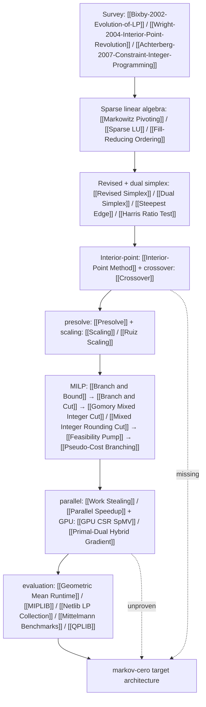

# Research Dependency Map — the field as a chain, layer by layer

> Which ideas *enable* which, from survey to target architecture, with a "current code" status per layer
> taken from `docs/audit/00-ground-truth.md` §C. Companion to [[cross-paper-synthesis|Cross-Paper Synthesis]].

**Citation legend.** `[E###]` = entry number in `docs/research_paper_references.md`.
Status values: **exists** / **partial** / **missing**.

## Diagram

```text
Survey (Bixby 2002 [E1], Wright 2004 [E2], Achterberg 2007 [E3]) → where the speedups live
  ↓
Sparse linear algebra (Markowitz [E17], Bartels–Golub [E12], Forrest–Tomlin [E13], Gilbert–Peierls [E14], AMD/COLAMD [E15,E16]) → enables basis updates
  ↓
Revised + dual simplex (Dantzig [E29], Goldfarb–Reid [E31], Harris [E32], Bland [E33], Koberstein [E37], Goldfarb–Forrest [E38]) → warm-startable node LPs
  ↓
Interior-point (Khachiyan [E46] → Karmarkar [E47] → Mehrotra [E49] → Wright [E51]) + Crossover (Ye [E58]) → a basis from the interior
  ↓
presolve (Andersen–Andersen [E62], Savelsbergh [E63], Achterberg et al. [E65]) + scaling (Curtis–Reid/Oren [E10,E73]) → smaller, better-conditioned models
  ↓
MILP: Land–Doig [E80] → Balas [E81] → B&B/B&C (Padberg–Rinaldi [E82], Achterberg et al. [E83]) → cuts (Gomory [E93,E94], Balas et al. [E95], MIR [E99], cover [E100])
  → heuristics (Fischetti et al. [E110], Danna et al. [E113]) → branching (Achterberg et al. [E127])
  ↓
parallel (Eckstein [E163], Berthold [E164], Huangfu–Hall [E43]) + GPU (cuPDLP [E177], Bell–Garland [E171]; Lai–Sahni [E173] is the warning) → scale-out
  ↓
evaluation (Dolan–Moré [E185], Mittelmann [E183], MIPLIB 2017 [E180], Lodi–Tramontani [E182]) → comparable, defensible numbers
  ↓
Our target architecture (markov-cero)
```



## Layer 0 — Orientation & survey (the priority order itself)

- **Chain:** [[Bixby-2002-Evolution-of-LP]] → [[Wright-2004-Interior-Point-Revolution]] → [[Achterberg-2007-Constraint-Integer-Programming]] → [[Maros-2003-Computational-Optimization-Techniques]] → foundations [[Nemhauser-1988-Integer-Combinatorial-Optimization]] / [[Vanderbei-1996-Foundations-and-Extensions]]
- **Enables:** the ordering of every layer below — Bixby splits LP gains into presolve + sparse LU + dual simplex + steepest-edge [E1]; Achterberg splits MIP into presolve/cuts/heuristics/branching/LP [E3].
- **Current code:** **partial** — the module split mirrors this blueprint ([[Multi-Engine Solver Architecture]]), but nothing maps phases to R1–R20 (ground-truth C.5: phase plan tracks implementation progress, not requirement coverage).

## Layer 1 — Sparse linear algebra (the enabling layer)

- **Chain:** [[Markowitz-1957-Elimination-Form-Inverse]] → [[Bartels-1969-Simplex-LU-Decomposition]] → [[Forrest-1972-Updating-Triangular-Factors]] → [[Gilbert-1988-Sparse-Partial-Pivoting]] → [[Amestoy-1996-Approximate-Minimum-Degree]] / [[Davis-2004-Column-Approximate-Minimum]] → [[Suhl-1990-Fast-LU-Factorization]] / [[Reid-1982-Sparsity-Exploiting-Variant]]
- **Enables:** every basis update and FTRAN/BTRAN, hence both simplex engines and the IPM/ADMM KKT solves; hyper-sparsity [E35] is the payoff branch.
- **Current code:** **partial** — `SparseLu` with min/max pivot and growth-factor diagnostics exists (`src/linalg/sparse_basis.cpp:130-143`), but the reference simplex is dense with caps 1024×8192 / 1e6 iterations (`src/lp/reference/revised_simplex.cpp:15-20`); no AMD/COLAMD call site appears in ground-truth §C (**Inference:** ordering quality unmeasured).

## Layer 2 — Revised + dual simplex (the re-optimization core)

- **Chain:** [[Dantzig-1963-Linear-Programming-Extensions]] → [[Dantzig-1954-Product-Form-Inverse]] → [[Goldfarb-1977-Practicable-Steepest-Edge]] / [[Harris-1973-Pivot-Selection-Methods]] / [[Bland-1977-Anti-Cycling-Rule]] → [[Koberstein-2005-Dual-Simplex-Method]] → [[Goldfarb-1992-Steepest-Edge-Simplex]] → [[Hall-2005-Hyper-sparsity-Revised-Simplex]] → [[Huangfu-2018-Parallelizing-Dual-Revised]] (parallel successor)
- **Enables:** warm-started node LPs ([[Warm Start]]), crossover's finishing step ([[Crossover]]), re-solves after cut insertion, reduced-cost fixing.
- **Current code:** **partial** — `revised_simplex` (Phase-I/II, Bland-only) and `dual_simplex` (warm start, Harris default, `tableau_norm` pricing documented as *not* dual steepest-edge) exist; steepest edge and EXPAND are absent (ground-truth C.3; [[Bland-Only Pricing]], [[Degeneracy Handling Gap]]).

### 2.1 → robustness sub-chain

- **Chain:** [[Charnes-1954-Optimality-Multi-Valuedness]] / [[Gill-1989-Practical-Anti-Cycling]] → [[Cline-1979-Estimate-Condition-Number]] → [[Gleixner-2015-Iterative-Refinement-Linear]] → [[Neumaier-2004-Safe-Bounds-Linear]] / [[Steinrucken-2019-Exact-Algorithms-Linear]]
- **Current code:** **partial** — triggers and verifiers exist (`condition_trigger` 1e-14, growth-factor aborts, independent KKT/Farkas verifiers); **missing** κ estimator and iterative refinement ([[Ill-Conditioning]], [[Numerical Stability]]).

## Layer 3 — Interior-point + crossover (the second LP engine)

- **Chain:** [[Khachiyan-1979-Polynomial-Algorithm-Linear]] → [[Karmarkar-1984-New-Polynomial-Time-Algorithm]] → [[Kojima-1989-Primal-Dual-Interior-Point-Algorithm]] → [[Mehrotra-1992-Implementation-Primal-Dual-Interior]] → [[Lustig-1992-Implementing-Mehrotras-Predictor-Corrector]] / [[Wright-1997-Primal-Dual-IPM]] → [[Vanderbei-1995-Symmetric-Indefinite-Systems]] (system choice) → [[Ye-1998-Crossover-Interior-Point]]
- **Enables:** a basis produced without pivoting, degeneracy-insensitive iteration counts, the QP IPM route ([[Sparse LDL Factorization]] shared with ADMM), and any honest reading of R4.
- **Current code:** **missing** — PS-GAP-06: no predictor-corrector, no central path, no KKT factorization inside the LP loop, no crossover ([[No Interior-Point Engine]], [[No Crossover]]); PDHG/PDLP is a *first-order* method in a different class ([[Primal-Dual Hybrid Gradient]], [[First-Order Accuracy Ceiling]]).

## Layer 4 — presolve + scaling (model reduction before any engine)

- **Chain:** [[Brearley-1975-Analysis-Mathematical-Programming]] → [[Curtis-1972-Simplex-LU-Decomposition]] / [[Oren-1980-Automatic-Scaling-Matrices]] → [[Andersen-1995-Presolving-Linear-Programming]] → [[Savelsbergh-1994-Preprocessing-Probing-Techniques]] → [[Gamrath-2015-Progress-Presolving-Mixed]] → [[Achterberg-2020-Presolve-Reductions-Mixed]] / [[Wang-2026-Enhancing-Presolve-Mixed]]
- **Enables:** smaller root LPs, implied bounds, early infeasibility proofs, and the conditioning that makes tolerances meaningful downstream ([[Weak Relaxation]]).
- **Current code:** **partial** — 4 rules (empty row/column, row singleton, fixed var, implied-bound-lite) with LIFO postsolve (`src/presolve/presolve.cpp:67-177, 255-308`); Ruiz scaling runs only on the `primal`/`pdlp` CLI branches, never on MILP/QP/parallel (`src/scale/ruiz_scaling.cpp:82-145`; [[Scaling]]). Probing, dual fixing, aggregation: **missing**.

## Layer 5 — MILP stack (enumeration → tree → cuts → heuristics → branching)

### 5.1 Enumeration → branch-and-cut framework

- **Chain:** [[Land-1960-Automatic-Method-Solving]] → [[Balas-1965-Additive-Algorithm-Solving]] → [[Padberg-1991-Branch-and-Cut-Algorithm]] → [[Achterberg-2005-General-Mixed-Integer]] → [[Bixby-2020-Compiling-Mixed-Integer]] / [[Linderoth-2005-Noncommercial-Software-Mixed]]

### 5.2 Cuts

- **Chain:** [[Gomory-1958-Outline-Algorithm-Integer]] → [[Gomory-1963-All-Integer-Programming]] → [[Balas-1980-Cuts-Fixed-Rank]] / [[Chvatal-1973-Edmonds-Polytopes-Hierarchy]] → [[Balas-1996-Gomory-Cuts-Revisited]] → [[Marchand-1996-Mixed-Integer-Rounding]] → [[Padberg-2005-Classical-Cuts-Mixed]] / [[Cornuejols-2008-Valid-Inequalities-Mixed]] → [[Turner-2024-Potential-Cutting-Planes]] (management)

### 5.3 Heuristics → branching

- **Chain:** [[Hillier-1969-Efficient-Heuristic-Procedures]] → [[Fischetti-2005-Feasibility-Pump]] → [[Danna-2004-Exploring-Relaxation-Induced]] / [[Fischetti-2003-Local-Branching]] → [[Berthold-2007-Heuristics-Branch-Cut]] → [[Berthold-2023-Feasibility-Jump]] ; [[Driebeek-1966-Algorithm-Assignment-Problem]] → [[Achterberg-2005-Branching-Rules-Revisited]] (η_rel=8, λ=4) → [[Held-2006-Lookahead-Branching-Mixed]] / [[Berthold-2006-Hybrid-Branching]]

- **Enables:** a complete R5 deliverable and the R20 times (tree size × node LP cost).
- **Current code:** **partial** — B&B/B&C driver with GMI+MIR root cuts, strong/reliability branching, rounding + feasibility-pump heuristics, best-bound node selection exist; **root-only cuts** (0.0% node reduction), **4 presolve rules**, no dive/RINS in evidence ([[Root-Only Cuts]]).

## Layer 6 — parallel + GPU (scale-out)

- **Chain:** [[Eckstein-1994-Control-Strategies-Parallel]] → [[Zhang-n.d.-On-Design-Parallel-Branch]] / [[Berthold-2019-Parallel-SCIP-UG]] → [[Lai-1984-Anomalies-Parallel-Branch]] (constraint) → [[Schweizer-2018-Deterministic-Parallel-MIP]] (measurement hygiene) → [[Bell-2008-Efficient-Sparse-Matrix]] → [[Unknown-2025-Overview-GPU-Based-First]] → [[Lu-2025-cuPDLP-GPU-Implementation]] / [[Lin-2025-PDCS-Primal-Dual]]
- **Current code:** **partial → regressed** — enables R7/R8 on paper only: `std::jthread` tree with a single mutex queue and serial root phase gives 0.56× at 4 threads (efficiency 14%); GPU end-to-end speedup <1 in 13/13 crossover rows with one `NumericalFailure` passing an unchecked test ([[Negative Parallel Scaling]], [[GPU Benefit Unproven]], [[Parallel Scalability Gap]]).

## Layer 7 — evaluation (what makes any claim checkable)

- **Chain:** [[Anderssen-1984-NETLIB-LP-Test-Set]] / [[Achterberg-2005-MIPLIB-2003]] → [[Gleixner-2021-MIPLIB-Data-Driven-Compilation]] → [[Dolan-2002-Benchmarking-Optimization-Software]] → [[Lodi-2013-Performance-Variability-Mixed]] → [[Mittelmann-n.d.-Benchmarks-Optimization-Software]] / [[Mittelmann-n.d.-Mittelmann-LP-MILP]] → [[Unknown-2024-Distributional-MIPLIB]] / [[Bussieck-2026-mipfeas-Benchmark]]
- **Current code:** **partial** — enables R15/R16/R19: 7+5 Netlib instances and 3 MIPLIB instances with single-run CSVs; **missing**: any external baseline column, any Mittelmann set, any QPLIB set, geometric-mean or profile aggregation, dispersion over runs ([[Missing External Baseline Comparison]], [[Mittelmann Coverage Gap]], [[No External Baseline]], [[Geometric Mean Runtime]]).

## Layer 8 — Our target architecture (where the chain terminates)

- **Shape:** [[CSC Sparse Model]] → [[Presolve-Postsolve Stack]] → [[Scaling]] → engine dispatch in [[Multi-Engine Solver Architecture]] → independent verification → postsolve → JSON (ground-truth C.2).
- **Required additions, in dependency order:** (a) sparse basis at scale + orderings [Layer 1]; (b) steepest-edge/Harris/EXPAND [Layer 2]; (c) IPM + crossover [Layer 3]; (d) full presolve + scaling on all branches [Layer 4]; (e) in-tree cuts + deeper heuristics [Layer 5]; (f) redesigned work distribution [Layer 6]; (g) baseline + aggregates + full benchmark sets [Layer 7].
- **Current code:** **partial overall** — ground-truth D judges the *core* ~70% and the *evaluation story* <20%; Layers 3 and 7 are the two structural holes (PS-GAP-03, PS-GAP-06).

**Inference:** the dependency order matters inside a 5-day window — Layer 7 (baseline + benchmarks) can be closed without touching Layers 1–6, while Layer 3 (IPM+crossover) rides on Layers 1–2 and therefore on existing sparse KKT machinery rather than new infrastructure ([[No Interior-Point Engine]]).
